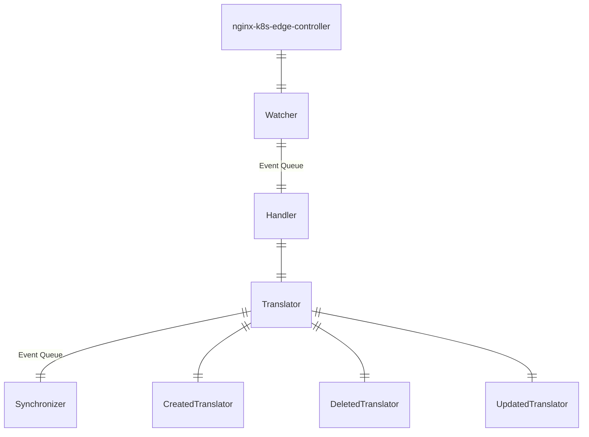

# Overview

The nginx-k8s-edge-controller is intended to run within Kubernetes and watch for changes in Ingress resources.
When changes are made -- creation, deletion, modification -- to Ingress definitions the controller will synchronize the nginx+ downstream objects.

## Basic Architecture

The controller is deployed in a Kubernetes Cluster. Upon startup, it registers interest in changes to Ingress resources within the Cluster.
A Watcher handles the events raised by the Cluster and uses the appropriate Translator to convert the events into NGINX+ requests, 
and then uses the Synchronizer to update the target NGINX+ instance via the [NGINX+ Configuration API](https://docs.nginx.com/nginx/admin-guide/load-balancer/dynamic-configuration-api/).

