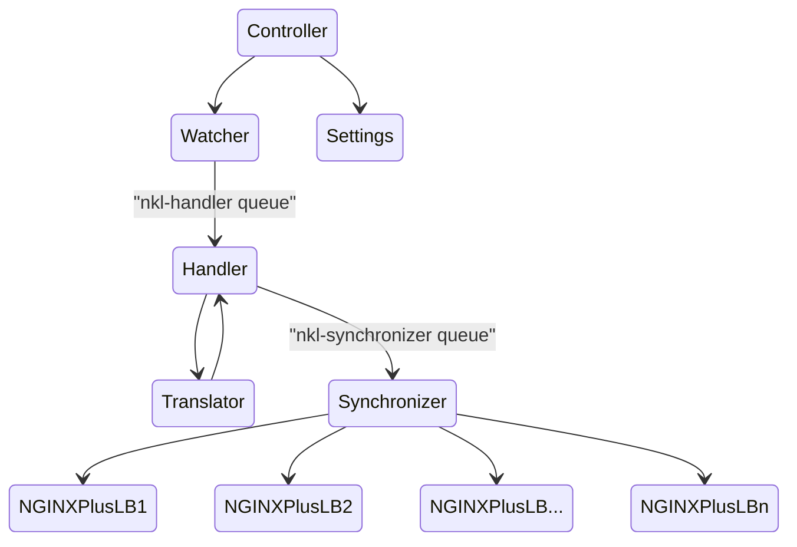

# Overview

The nginx-k8s-edge-controller runs in a Kubernetes Cluster and responds to changes in resources of interest, updating designated NGINX Plus hosts with the appropriate configuration.

## Basic Architecture

The controller is deployed in a Kubernetes Cluster. Upon startup, it registers interest in changes to Service resources in the "nginx-ingress" namespace.
The Handler accepts the events raised by the Cluster and calls the Translator to convert the events into event definitions that are used to update NGINX Plus hosts. 
Next, the Handler calls the Synchronizer with the list of translated events which are fanned-out for each NGINX host.
Lastly, the Synchronizer calls the [NGINX+ Configuration API](https://docs.nginx.com/nginx/admin-guide/load-balancer/dynamic-configuration-api/) using the [NGINX Plus Go client](https://github.com/nginxinc/nginx-plus-go-client) to update the target NGINX Plus host(s). 



### Settings

The Settings module is responsible for loading the configuration settings from the "nkl-config" ConfigMap resource in the "nkl" namespace.
The Settings are loaded when the controller starts and are reloaded when the "nkl-config" ConfigMap resource is updated.

### Watcher

The Watcher is responsible for monitoring changes to Service resources in the "nginx-ingress" namespace.
It registers methods that handle each event type. Events are handled by creating a `core.Event` instance and adding it to the "nkl-handler" queue. 
When adding the event to the queue, the Watcher also retrieves the list of Node IPs and adds the list to the event. 
The master node ip is excluded from the list. (NOTE: This should be configurable.)

### Handler

The Handler is responsible for taking the `core.Event` instances from the "nkl-handler" queue and calling the Translator to convert the event into a `core.ServerUpdateEvent` instance, 
adding each `core.ServerUpdateEvent` to the "nkl-synchronizer" queue.

### Translator

The Translator is responsible for converting the `core.Event` event into an `nginxClient.UpstreamServer` event.
This involves filtering out the `core.Event` instances that are not of interest to the controller by accepting only Port names starting with the NklPrefix value (currently _nkl-_).
The event is then fanned-out based on the defined Ports, one event per defined Port. Each port is then augmented with the Ingress name (the name configured in the Port definition with the NklPrefix value removed), 
and the list of the Node's IP addresses.

The Translator passes the list of events to the Synchronizer by calling the `AddEvents` method. 

**NOTE: It is important that the Port names match the name of the defined NGINX Plus Upstreams.**

In the following example the NGINX Plus Upstreams are named "nkl-nginx-lb-http" and "nkl-nginx-lb-https". These match the name in the NGINX Plus configuration.

```yaml
apiVersion: v1
kind: Service
metadata:
  name: nginx-ingress
  namespace: nginx-ingress
spec:
  type: NodePort 
  ports:
  - port: 80
    targetPort: 80
    protocol: TCP
    name: nkl-nginx-lb-http
  - port: 443
    targetPort: 443
    protocol: TCP
    name: nkl-nginx-lb-https
  selector:
    app: nginx-ingress
```

### Synchronizer

The Synchronizer is responsible for fanning-out the given list of `core.ServerUpdateEvent` events, one for each configured NGINX Plus host.
The NGINX Plus hosts are configured using a ConfigMap resource named "nkl-config" in the "nkl" namespace. An example of the ConfigMap is shown below.

```yaml
apiVersion: v1
kind: ConfigMap
data:
  nginx-hosts:
    "http://10.1.1.4:9000/api,http://10.1.1.5:9000/api"
metadata:
  name: nkl-config
  namespace: nkl
```

This example includes two NGINX Plus hosts to support High Availability.

Additionally, the Synchronizer is responsible for taking the `core.ServerUpdateEvent` instances from the "nkl-synchronizer" queue and updating the target NGINX Plus host. 
The Synchronizer uses the [NGINX Plus Go client](https://github.com/nginxinc/nginx-plus-go-client) to communicate with each NGINX Plus host.


#### Retry Mechanism

The Synchronizer uses a retry mechanism to handle failures when updating the NGINX Plus hosts. 
The retry mechanism is implemented in the workqueue using the `workqueue.NewItemExponentialFailureRateLimiter`, 
having defaults set to a base of 2 seconds, and a maximum of 60 seconds.

### Jitter

The Synchronizer uses a jitter mechanism to avoid thrashing the NGINX Plus hosts. Each `core.ServerUpdateEvent` instance 
is added to the "nkl-synchronizer" queue with a random jitter value between 250 and 750 milliseconds.
