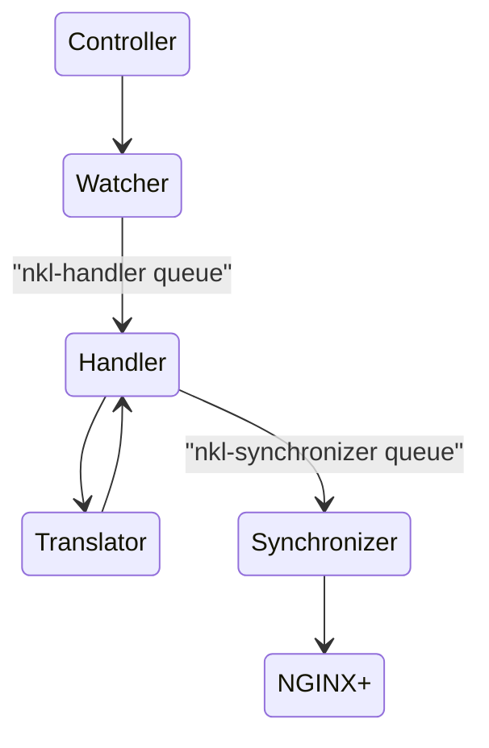

# Overview

The nginx-k8s-edge-controller is intended to run within Kubernetes and watch for changes in Ingress resources.
When changes are made -- creation, deletion, modification -- to Ingress definitions the controller will synchronize the nginx+ downstream objects.

## Basic Architecture

The controller is deployed in a Kubernetes Cluster. Upon startup, it registers interest in changes to Ingress resources within the Cluster.
A Watcher handles the events raised by the Cluster and uses the appropriate Translator to convert the events into NGINX+ requests, 
and then uses the Synchronizer to update the target NGINX+ instance via the [NGINX+ Configuration API](https://docs.nginx.com/nginx/admin-guide/load-balancer/dynamic-configuration-api/).

### Event Handler

The event handling is implemented using two [k8s work queues](https://pkg.go.dev/k8s.io/client-go/util/workqueue). 
The first queue, "nkl-handler", is populated with `core.Event` instances by the Watcher which are based upon the events 
raised by k8s.

The Handler then takes the `core.Event` instances and calls the `translation.Translator` to convert the event into a `nginx.Nginx` instance. 
The `core.Event` instance is update with the `nginx.Nginx` instance and then placed on the second queue, named "nkl-synchronizer". 

### Synchronizer

The Synchronizer is responsible for taking the `core.Event` instances from the "nkl-synchronizer" queue and updating the target NGINX+
using the `nginx.Nginx` member of the event.

### Translator

The Translator is responsible for converting the `k8s.Ingress` resource definition into an `nginxClient.UpstreamServer` definition.

### Retry Mechanism

The Synchronizer uses a retry mechanism to handle failures when updating the NGINX+ instance. 
The retry mechanism is implemented in the workqueue using the `workqueue.NewItemExponentialFailureRateLimiter`. 
Each workqueue can be configured independently, having defaults set to a base of 2 seconds, and a maximum of 60 seconds.