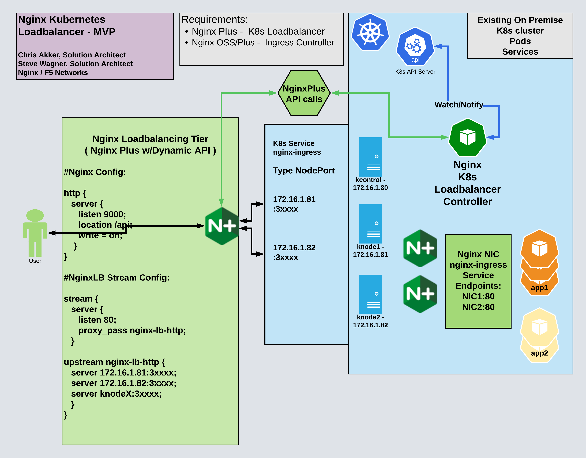
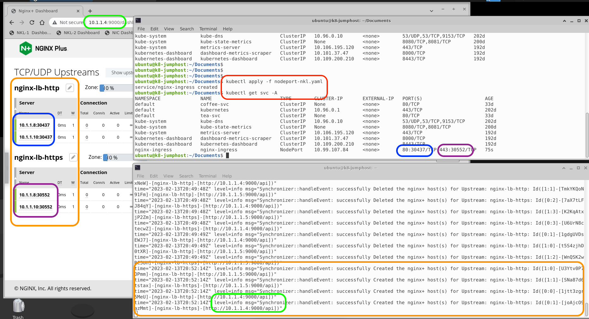

# nginx-k8s-edge-controller

## Welcome to the Nginx Kubernetes Load Balancer project !

 

This repo contains source code and documents for a new Kubernetes Controller, that provides TCP load balancing external to a k8s cluster.  It is a replacement for a Cloud Providers "Service Type Loadbalancer", that is missing from On Premises Kubernetes Clusters.

 

## Overview

- Create a new K8s Controller, that will monitor specified k8s Service Endpoints, and then send API calls to an external NginxPlus server to manage Nginx Upstream server blocks.  
- This is will synchronize the K8s Service Endpoint list, with the Nginx LB server's Upstream block server list.  
- The primary use case is for tracking the NodePort IP:Port definitions for the Nginx Ingress Controller's `nginx-ingress Service`.  
- With the NginxPlus Server located external to the K8s cluster, this new controller LB function would provide an alternative TCP "Load Balancer Service" for On Premises k8s clusters, which do not have access to a Cloud providers "Service Type LoadBalancer".
- Make the solution a native Kubernetes Component, configured and managed with standard K8s tools.

 

## Reference Diagram

 

 

## Sample Screenshots of Runtime

### Configuration with 2 Nginx LB Servers defined (HA):

 

### Nginx LB Server Dashboard and Logging

Legend:
- Red - kubectl commands
- Blue - nodeport and upstreams for http traffic
- Indigo - nodeport and upstreams for https traffic
- Green - logs for api calls to LB Server #1
- Orange - Nginx LB Server upstream dashboard details
- Kubernetes nodes are 10.1.1.8 and 10.1.1.10

 

## Requirements

Please see the /docs folder for detailed documentation.

## Installation

Please see the /docs folder for detailed documentation.

 

## Development

No contributions are being accepted at this time.
Read the [`CONTRIBUTING.md`](https://github.com/nginxinc/nginx-k8s-edge-controller/blob/main/CONTRIBUTING.md) file.

 

## License

[Apache License, Version 2.0](https://github.com/nginxinc/nginx-k8s-edge-controller/blob/main/LICENSE)

&copy; [F5 Networks, Inc.](https://www.f5.com/) 2023
