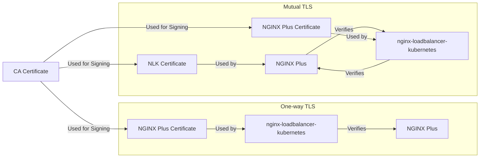

## One-way TLS and Mutual TLS

There are two types of TLS: one-way TLS and mutual TLS.

### One-way TLS

One-way TLS is the most common type of TLS. In one-way TLS, the client verifies the server's identity, but the server does not verify the client's identity. One-way TLS is used to secure the connection between the client and the server.

### Mutual TLS

Mutual TLS is less common than one-way TLS. In mutual TLS, the client verifies the server's identity, and the server verifies the client's identity. Mutual TLS is used to secure the connection between the client and the server.

The following diagram shows the difference between one-way TLS and mutual TLS.

[Next](SLIDE-5.md)