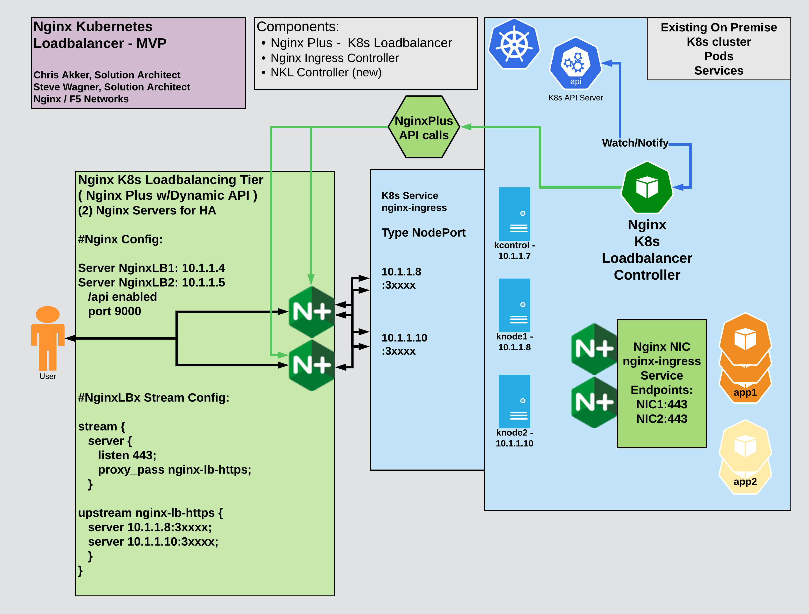

# New Nginx LB Solution - "Nginx Kubernetes Loadbalancer"

<br/>

- Build an Nginx Kubernetes Loadbalancer Controller for MVP
- Provide a functional replacement for the "Loadbalancer Service Type" external to an On Premises K8s cluster.
- Chris Akker  / Jan 2023 / Initial draft
- Steve Wagner / Jan 2023 / Initial code

<br/>

## Abstract:

- Create a new K8s Controller, that will monitor specified k8s Service Endpoints, and then send API calls to an external NginxPlus server to manage Nginx Upstream server blocks.  
- This is will synchronize the K8s Service Endpoint list, with the Nginx LB server's Upstream block server list.  
- The primary use case is for tracking the NodePort IP:Port definitions for the Nginx Ingress Controller's `nginx-ingress Service`.  
- With the NginxPlus Server located external to the K8s cluster, this new controller LB function would provide an alternative TCP "Load Balancer Service" for On Premises k8s clusters, which do not have access to a Cloud providers "Service Type LoadBalancer".
- The solution works as a native Kubernetes Controller object, configured and managed with standard K8s tools.

<br/>

## Solution Description:

When running a k8s Cluster On Premises, there is no equivalent to a Cloud Provider's `Loadbalancer` Service Type.  This solution and new controller software is the TCP load balancer functional replacement.

When using a Cloud Provider's Loadbalancer Service Type, it provides 3 basic functions for External access to the k8s pods/services running inside the cluster:

1. Public IP address allocation, visible from the Internet
2. DNS record management for this Public IP (usually A records for FQDNs)
3. TCP loadbalancing, from the PublicIP:well-known-ports, to the NodePort:high-number-ports of the cluster nodes.  

This is often called "NLB", a term used in AWS for Network Load Balancer, but functions nearly identical in all Public Cloud Provider networks.  It is not actually a component of K8s, rather, it is a service provided by the Cloud Providers SDN (Software Defined Network), but is managed by the user with K8s Service Type LoadBalancer definitions/declarations.

<br/>

>**This Solution uses NGINX to provide an alternative to #3, the TCP loadbalancing from PublicIP to k8s NodePort.**

Note: This solution is not for Cloud-based K8s clusters, it is only for On Premises K8s clusters.

<br/>

## Reference Diagram:

<br/>



<br/>

## Business Case

- Every On Premises Kubernetes cluster needs this Solution, for external clients to access pods/service running inside the cluster.
- Market opportunity is at least one NginxPlus license for every k8s cluster.  Two licenses if you agree that High Availability is a requirement.
- Exposing Pods and Services with NodePort requires the use of high numbered TCP ports (greater than 30000 by default).  Lower, well-known TCP port numbers less than 1024 are NOT allowed to bind to the k8s Nodes' IP address.  This contradicts the ephemeral dynamic nature of k8s itself, and mandates that all HTTP URLs must contain port numbers unfamiliar to everyone.
- There is a finite limit of available NodePorts available, as 30000-32767 is the default range, leaving ~ 2768 usable ports.
- The tracking and allocation of which pod/service is using what TCP port is manual and tedius for app dev and devops teams.

Alternatives:
- CIS with BIG-IP
- MetalLB
- AVI Networks / VMWare
- Many Other HW Vendors

However, most of these alternatives are proprietary, open source / unsupported, competitive, or have other customer concerns.

<br/>

>**`NGINX PLUS is a viable alternative for most customers.`**

<br/>

Why not Nginx OpenSource?  Nginx Open Source does not have the API endpoint and service for managing Upstream Server block configurations.

<br/>

## Definition of Terms

- NKL - Nginx Kubernetes Loadbalancer - the name of this Solution
- NEC - Nginx LB Controller - k8s controller / watcher
- Nginx LB - An NginxPlus server external to the k8s cluster
- NIC - Nginx Ingress Controller pod
- Nginx Ingress Endpoints - the list of IP:Ports for the nginx-ingress Service defined in K8s.
- Nginx-lb-http - the Nginx LB Server Upstream block that represents the mapped Nginx Ingress Controller(s) `Host:NodePort` Endpoints for http
- Nginx-lb-https - the Nginx LB Server Upstream block that represents the mapped Nginx Ingress Controller(s) `Host:NodePort` Endpoints for https
- NodePort nginx-ingress Service - exposes the Nginx Ingress Controller(s) on Host:Port
- Plus API - the standard Nginx Plus API service that is running on the Nginx LB Server
- Nginx Plus Go Client - software that communicates with the Nginx LB Server
- Upstream - the IP:Port list of servers that Nginx will Load Balance traffic to at Layer 4 TCP using the stream configuration
- Fan-out support - the ability to run 2 or more Nginx LB servers external to the cluster for High Availability

<br/>

## Development requirements for the Nginx K8s LB controller

<br/>

Preface -  Define access parameters for NKL Controller to communicate with NginxPlus instance:
- IP address:port of the target Nginx LB Server(s)
- Optional auth:  SSL certificate/key
- Optional auth:  IP allow list
- Optional auth:  HTTP Auth userid/password
- Optional auth:  JWT Token

1. Initialization:

- Define the name of the target Upstream Server Block
- "nginx-lb-http" or "nginx-lb-https" should be the default server block names, returns error if these do not exist
- Using the Nginx Plus Go Client library, make an API query to NginxPlus LB server for current Upstream list
- API query to K8s apiserver for list of Ingress Controller Endpoints
- Reconcile the two lists, making changes to Nginx Upstreams to match the Ingress Endpoints ( add / delete Upstreams as needed to converge the two lists )

2. Configuration Requirements:

- List of Nginx LB server IP:Ports, comma separated
- List of K8s worker nodes
- List of Nginx LB server upstream block names, current defaults are "nginx-lb-http" and "nginx-lb-https" - `nginxlb.conf` for examples
- Nodeport Definition file, port names MUST match the upstream block names in the correct format, prefixed with `nkl-`, as in `nkl-nginx-lb-http` and `nkl-nginx-lb-https`

3. Runtime:

- Register the LB Controller with the K8s watcher Service, subscribe to Notifications for changes to the nginx-ingress Service Endpoints.
- Using the Nginx Plus Go Client libraries, modify Upstream server entries, based on K8s NodePort Service endpoint "Notification" changes
- Add new Endpoint to Upstream Server list on k8s Notify
- Remove deleted Endpoints to Upstream list on k8s Notify
- Log changes to debug, nginx error.log, custom access.log and controller log as appropriate

4. Main program

- Compare the list of Upstream servers from the Nginx API call, with the list nginx-ingress Service Endpoints from the K8s API call
- Calculate the difference in the list, and create new Nginx API calls to update the Upstream list, adding or removing the changes needed to mirror the nginx-ingress Service Endpoints list
- Periodic check - API query for the list of Servers in the Upstream block, using the NginxPlus API ( query interval TBD )
- IP:port definition
- other possible metadata collection: status, connections, response_time, etc
- Register the LB Controller for liveness probes, so K8s has and endpoint to query for up/down status.
- Log these changes

6. Optional:  Add additional features/functions here, beyond MVP.

<br/>

## PM/PD Suggestion - to build this new Controller, use the existing Nginx Ingress Controller framework/code, to create this new k8s LB Controller, leveraging the Enterprise class, supportable code Nginx already has on hand.  Or perhaps, add this Loadbalancer solution as a new Feature to the exising Ingress Controller ( NIC, after all, it is already watching the nginx-ingress namespace and services ).

<br/>

### Example Nginx Plus API requests for Upstream block changes

<br/>

Here are some examples of using cURL to the Nginx Plus API to control Upstream server blocks:

<Nginx API call to add Upstream Server, Nginx LB Server is at 172.16.1.15:9000 in these examples>

Nginx API is listening on port 9000.  To enable the Nginx Plus API, refer to these instructions:
https://docs.nginx.com/nginx/admin-guide/monitoring/live-activity-monitoring/

("jq" is used to format the Json responses into easy to read output.)

<br/>

To `ADD` a new server to the Upstream group “nginx-lb-http”:

curl -X POST -d ‘{ “server”: “172.16.1.81:32080” }’ -s ‘http://172.16.1.15:9000/api/4/stream/upstreams/nginx-lb-http/servers’

  
To `LIST` the Servers in an Upstream group called "nginx-lb-http":
curl http://172.16.1.15:9000/api/4/stream/upstreams/nginx-lb-http/ | jq
 
To `DISABLE` the existing Upstream Server with ID = 0:
curl -X PATCH -d ‘{ “down”: true }’ -s ‘http://172.16.1.15:9000/api/4/stream/upstreams/nginx-lb-http/servers/0’
 
Response is:
{“id”:0,”server”:”127.0.0.1:8081”,”weight”:1,”max_conns”:0,”max_fails”:1,”fail_timeout”:”10s”,”slow_start”:”0s”,”route”:””,”backup”:false,”down”:true}
 
To `ENABLE` an existing Upstream Server with ID = 0 that is down:
curl -X PATCH -d ‘{ “down”: false }’ -s ‘http://172.16.1.15:9000/api/4/stream/upstreams/nginx-lb-http/servers/0’
 
Response is:
{“id”:0,”server”:”127.0.0.1:8081”,”weight”:1,”max_conns”:0,”max_fails”:1,”fail_timeout”:”10s”,”slow_start”:”0s”,”route”:””,”backup”:false,”down”:false}
 
To `ADD` a new server to the Upstream group “nginx-lb-http”, with 60 seconds slow start:
curl -X POST -d ‘{ “server”: “127.0.0.1:8085”,”slow_start”: “60s” }’ -s ‘http://172.16.1.15:9000/api/4/stream/upstreams/nginx-lb-http/servers’
 
Response is:
{“id”:9,”server”:”127.0.0.1:8085”,”weight”:1,”max_conns”:0,”max_fails”:1,”fail_timeout”:”10s”,”slow_start”:”60s”,”route”:””,”backup”:false,”down”:false}
 
To `DRAIN` connections off an existing Upstream Server with ID = 2
curl -X PATCH -d '{ "drain": true }' -s 'http://172.16.1.15:9000/api/4/stream/upstreams/nginx-lb-http/servers/2'
 
Response is:
{"id":2,"server":"127.0.0.1:8083","weight":1,"max_conns":0,"max_fails":1,"fail_timeout":"10s","slow_start":"0s","route":"","backup":false,"down":false,"drain":true}

Note:  During recent testing with R28 and API version 8, the Drain command was 404 - not found for Stream Upstreams.  According to docs, DRAIN is only supported on HTTP Upstreams - to be verified.
 
To `CHANGE the LB WEIGHT` of an Upstream Server with ID = 2:
curl -X PATCH -d '{ "weight": 3 }' -s 'http://172.16.1.15:9000/api/4/stream/upstreams/nginx-lb-http/servers/2'
 
Response is:
{"id":2,"server":"127.0.0.1:8083","weight":3,"max_conns":0,"max_fails":1,"fail_timeout":"10s","slow_start":"0s","route":"","backup":false,"down":false}

Add upstream with JSON:

curl -X POST "http://10.1.1.4:9000/api/8/stream/upstreams/nginx-lb-https/servers/" -H "accept: application/json" -H "Content-Type: application/json" -d "{ \"server\": \"10.1.1.99:31269\" }"

<br/>

## References:

Cloud Provider's K8s Loadbalancer Service Type:

https://kubernetes.io/docs/tasks/access-application-cluster/create-external-load-balancer/

- AWS: https://aws.amazon.com/premiumsupport/knowledge-center/eks-kubernetes-services-cluster/
- GCP: https://cloud.google.com/kubernetes-engine/docs/concepts/service-load-balancer
- Azure: https://learn.microsoft.com/en-us/azure/load-balancer/components#frontend-ip-configurations
- Digital Ocean: https://docs.digitalocean.com/products/kubernetes/how-to/add-load-balancers/
- You get the point - this Service does not exist in private data centers

Kubernetes controllers:

https://kubernetes.io/docs/concepts/architecture/controller/#:~:text=In%20Kubernetes%2C%20controllers%20are%20control,closer%20to%20the%20desired%20state.

Nginx Ingress Controller, how it works:

https://docs.nginx.com/nginx-ingress-controller/intro/how-nginx-ingress-controller-works/

Nginx API: http://nginx.org/en/docs/http/ngx_http_api_module.html

Example: http://nginx.org/en/docs/http/ngx_http_api_module.html#example

Nginx Plus Go Client:  https://github.com/nginxinc/nginx-plus-go-client

Nginx Upstream API examples:  http://nginx.org/en/docs/http/ngx_http_api_module.html#stream_upstreams_stream_upstream_name_servers_stream_upstream_server_id

<br/>

## Sample NginxPlus LB Server configuration ( server and upstream blocks )

```bash
# NginxK8sLB Stream configuration, for L4 load balancing
# Chris Akker, Jan 2023
# TCP Proxy and load balancing block
# Nginx Kubernetes Loadbalancer
# State File for persistent reloads/restarts
# Health Check Match example for cafe.example.com
#
#### nginxk8slb.conf

   upstream nginx-lb-http {
      zone nginx-lb-http 256k;
      state /var/lib/nginx/state/nginx-lb-http.state; 
    }

   upstream nginx-lb-https {
      zone nginx-lb-https 256k;
      state /var/lib/nginx/state/nginx-lb-https.state; 
    }

   server {
      listen 80;
      status_zone nginx-lb-http;
      proxy_pass nginx-lb-http;
      health_check match=cafe;
    }
             
   server {
      listen 443;
      status_zone nginx-lb-https;
      proxy_pass nginx-lb-https;
      health_check match=cafe;
    }

   match cafe {
      send "GET cafe.example.com/ HTTP/1.0\r\n";
      expect ~ "30*";
    }


# Nginx State Files Required for Upstreams
# state file /var/lib/nginx/state/nginx-lb-http.state

# state file /var/lib/nginx/state/nginx-lb-https.state
```
