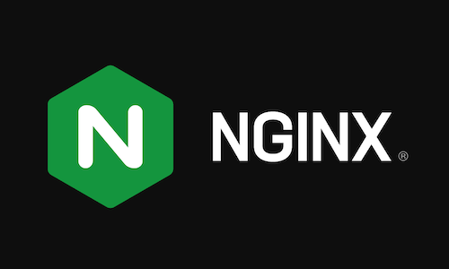

# nginx-k8s-loadbalancer

 

# Welcome to the Nginx Kubernetes Load Balancer Solution!

 

 | 
--- | ---

 

This repo contains source code and documents for a new `Kubernetes Controller from Nginx`, that provides TCP and HTTP load balancing external to a Kubernetes Cluster running On Premises.

 

>>**This is a replacement for a Cloud Providers `Service Type Loadbalancer`, that is not available for On Premises Kubernetes Clusters.**

 
 

# Overview

- `NKL - Nginx Kubernetes Loadbalancer` is a new K8s Controller from Nginx, that monitors specified K8s Services, and then sends API calls to an external Nginx Plus server to manage Nginx Upstream servers dynamically.
- This will `synchronize` the K8s Service Endpoint list, with the Nginx LB Server's upstream list.
- The primary use case and Solution provided is for tracking the K8s` NodePort` IP:Port definitions for the Nginx Ingress Controller's `nginx-ingress Service`.
- NKL is a native Kubernetes Controller, running, configured and managed with standard K8s commands.
- NKL paired with the Nginx Plus Server located external to the K8s cluster, this new controller LB function will provide a `TCP Load Balancer Service` for On Premises K8s clusters, which do not have access to a Cloud providers "Service Type LoadBalancer".
- NKL paired with the Nginx Plus Server located external to the Cluster, using Nginx's advanced HTTP features, provide an `HTTP Load Balancer Service` for Enterprise traffic management solutions, such as:
    - MultiCluster Active/Active Load Balancing
    - Horizontal Cluster Scaling
    - HTTP Split Clients - for A/B, Blue/Green, and Canary test and production traffic steering.  Allows Cluster operations/maintainence like upgrades, patching, expansion and troubleshooting with no downtime or reloads
    - Advanced TLS Processing - MutualTLS, OCSP, FIPS, dynamic cert loading
    - Advanced Security features - Oauth, JWT, App Protect WAF Firewall, Rate and Bandwidth limits
    - Nginx Java Script (NJS) for custom solutions
    - Nginx Zone Sync of KeyVal data

 

## NKL Controller Software Design Overview - How it works

[NKL Controller DESIGN and Architecture](DESIGN.md)

 

## Reference Diagram for NKL TCP Load Balancer Service

 

 

## Sample Screenshots of Solution at Runtime

 

### ConfigMap with 2 Nginx LB Servers defined for HA

 

### Nginx LB Server Dashboard, NodePort, and NKL Controller Logging

### Legend:
- Red - kubectl nodeport commands
- Blue - nodeport and upstreams for http traffic
- Indigo - nodeport and upstreams for https traffic
- Green - NKL log for api calls to LB Server #1
- Orange - Nginx LB Server upstream dashboard details
- Kubernetes Worker Nodes are 10.1.1.8 and 10.1.1.10

 

The `Installation Guide` for TCP Loadbalancer Solution is located in the tcp folder:

[TCP Installation Guide](tcp/tcp-installation-guide.md)

 

The `Installation Guide` for HTTP Loadbalancer Solution is located in the http folder:

[HTTP Installation Guide](http/http-installation-guide.md)

 

## Requirements

Please see the /docs folder and Installation Guides for detailed documentation.

 

## Development

Read the [`CONTRIBUTING.md`](https://github.com/nginxinc/nginx-k8s-loadbalancer/blob/main/CONTRIBUTING.md) file.

 

## Authors
- Chris Akker - Solutions Architect - Community and Alliances @ F5, Inc.
- Steve Wagner - Solutions Architect - Community and Alliances @ F5, Inc.

 

## License

[Apache License, Version 2.0](https://github.com/nginxinc/nginx-k8s-loadbalancer/blob/main/LICENSE)

&copy; [F5 Networks, Inc.](https://www.f5.com/) 2023
