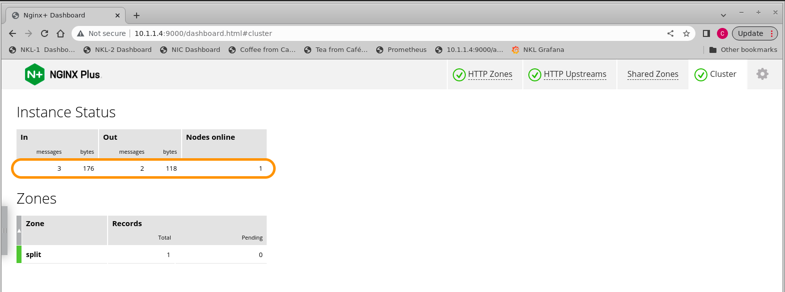
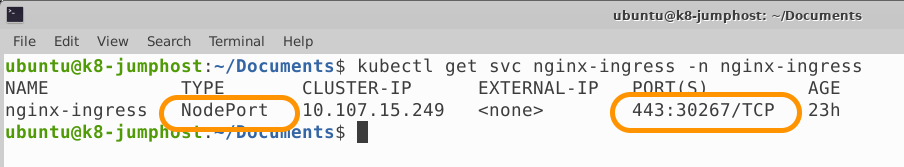

# Nginx Kubernetes Loadbalancer - MultiCluster LB Solution

<br/>

## This is the `HTTP Installation Guide` for the Nginx Kubernetes Loadbalancer Controller Solution.  It contains detailed instructions for implementing the different components for the Solution.

<br/>

 |  | 
--- | --- | ---

<br/>

## Solution Overview

This Solution from Nginx provides Enterprise class features which address common challenges with networking, traffic management, and High Availability for On-Premises Kubernetes Clusters.

1. Provides a `replacement Loadbalancer Service.`  The Loadbalancer Service is a key component provided by most Cloud Providers.  However, when running a cluster On Premises, the `Loadbalancer Service is not available.`  This Solution provides a replacement, using an Nginx Server, and a new K8s Controller.  These two components work together to watch the `NodePort Service` in the cluster, and immediately update the Nginx LB Server when changes occur.  No more static `ExternalIP` needed in your loadbalancer.yaml Manifests!
2. Provides MultiCluster Load Balancing, traffic steering, health checks, TLS termination, advanced LB algorithms, and enhanced metrics.
3. Provides dynamic, ratio-based Load Balancing for Multiple Clusters.  This allows for advanced traffic steering, and operation efficiency with no Reloads or downtime.
  - High Availability
  - Horizontal Cluster scaling
  - Non-stop seemless K8s Cluster upgrades, migrations, patching
  - HTTP Split clients for A/B, Blue/Green, and Canary testing and production traffic
  - Additional security features like App Protect Firewall, JWT auth, Rate Limiting, Service and Bandwidth controls, FIPS, advanced TLS features.

<br/>


<br/>

## Pre-Requisites

- Working kubernetes clusters, with admin privleges
- Running `nginx-ingress controller`, either OSS or Plus. This install guide followed the instructions for deploying an Nginx Ingress Controller here:  https://docs.nginx.com/nginx-ingress-controller/installation/installation-with-manifests/
- Demo application, this install guide uses the Nginx Cafe example, found here:  https://github.com/nginxinc/kubernetes-ingress/tree/main/examples/ingress-resources/complete-example
- A bare metal Linux server or VM for the external LB Server, connected to a network external to the cluster.  Two of these will be required if High Availability is needed, as shown here.
- Nginx Plus software loaded on the LB Server(s). This install guide follows the instructions for installing Nginx Plus on Centos 7, located here: https://docs.nginx.com/nginx/admin-guide/installing-nginx/installing-nginx-plus/
- The Nginx Kubernetes Loadbalancer (NKL) Controller, new software for this Solution.

<br/>

## Kubernetes Clusters

<br/>


<br/>

A standard K8s cluster is all that is required, two or more Clusters if you want to MultiCluster LB using HTTP Split Clients.  There must be enough resources available to run the Nginx Ingress Controller, and the Nginx Kubernetes Loadbalancer Controller, and test application like the Cafe Demo.  You must have administrative access to be able to create the namespace, services, and deployments for this Solution.  This Solution was tested on Kubernetes version 1.23.  Most recent versions => v1.21 should work just fine.

<br/>

## Nginx Ingress Controller

<br/>


<br/>

The Nginx Ingress Controller in this Solution is the destination target for traffic (north-south) that is being sent to the cluster(s).  The installation of the actual Ingress Controller is outside the scope of this guide, but the links to the docs are included for your reference.  `The NIC installation using Manifests must follow the documents exactly as written,` as this Solution depends on the `nginx-ingress` namespace and service objects.  **Only the very last step is changed.**  

**NOTE:** This Solution only works with `nginx-ingress from Nginx`.  It will `not` work with the K8s Community version of Ingress, called ingress-nginx.  

If you are unsure which Ingress Controller you are running, check out the blog on Nginx.com:  
    
https://www.nginx.com/blog/guide-to-choosing-ingress-controller-part-4-nginx-ingress-controller-options


>Important!  The very last step in the NIC deployment with Manifests, is to deploy the `nodeport.yaml` Service file.  `This file must be changed - it is not the default nodeport file.`  
Instead, use the `nodeport-cluster1.yaml` manifest file that is provided here with this Solution.  The "ports name" in the Nodeport manifest `MUST` be in the correct format for this Solution to work correctly.  The port name is the mapping from NodePorts to the LB Server's upstream blocks.  The port names are intentionally changed to avoid conflicts with other NodePort definitions.

Review the new `nodeport-cluster1.yaml` Service defintion file:

```yaml
# NKL Nodeport Service file
# Chris Akker, Apr 2023
# NodePort -ports name must be in the format of
#
## nkl-<upstream-block-name> ##
# 
#
apiVersion: v1
kind: Service
metadata:
  name: nginx-ingress
  namespace: nginx-ingress
spec:
  type: NodePort 
  ports:
  - port: 443
    targetPort: 443
    protocol: TCP
    name: nkl-cluster1-https  # This must match Nginx upstream name
  selector:
    app: nginx-ingress

```

Apply the updated nodeport-cluster1.yaml Manifest:

```bash
kubectl apply -f nodeport-cluster1.yaml
```

**NOTE:** If you have a second K8s cluster, and you want to Load Balance both Clusters using the MultiCluster Solution, repeat the appropriates steps on your second cluster.  

**IMPORTANT:  Do NOT mix and match nodeport-clusterX.yaml files.**  

- `nodeport-cluster1.yaml` must be used for Cluster1, `nodeport-cluster2.yaml` must be used for Cluster2.  The NodePort definitions must match each cluster exactly.
- Nodeports and manifest files must match the target cluster for the HTTP Split Clients dynamic ratio configuration to work correctly.  
- It is highly recommended that you configure, test, and verify traffic is flowing correctly on Cluster1, before you add Cluster2.  
- Be aware of and properly set your `./kube/config Cluster Context`, before applying one of these nodeport definitions.

<br/>

## Demo Application

<br/>


<br/>

This is not part of the actual Solution, but it is useful to have a well-known application running in the cluster, as a known-good target for test commands.  The example provided here is used by the Solution to demonstrate proper traffic flows.  

Note: If you choose a different Application to test with, `the Nginx health checks provided here will likely NOT work,` and will need to be modified to work correctly.

- Use the provided Cafe Demo manifests in the cafe-demo folder:

  ```bash
  kubectl apply -f cafe-secret.yaml
  kubectl apply -f cafe.yaml
  kubectl apply -f cafe-virtualserver.yaml
  ```

- The Cafe Demo reference files are located here:

  https://github.com/nginxinc/kubernetes-ingress/tree/main/examples/ingress-resources/complete-example

- The Cafe Demo Docker image used is an upgraded one, with simple graphics and additional Request and Response variables added.

  https://hub.docker.com/r/nginxinc/ingress-demo

**IMPORTANT** - Do not use the `cafe-ingress.yaml` file.  Rather, use the `cafe-virtualserver.yaml` file that is provided here.  It uses the Nginx Plus CRDs to define a VirtualServer, and the related Virtual Server Routes needed.  If you are using Nginx OSS Ingress Controller, you will need to comment out the healthcheck parameters.

<br/>

## Linux VM or bare-metal server

 | 

<br/>


This is any standard Linux OS system, based on the Linux Distro and Technical Specs required for Nginx Plus, which can be found here: https://docs.nginx.com/nginx/technical-specs/   

This Solution followed the "Installation of Nginx Plus on Centos/Redhat/Oracle" steps for installing Nginx Plus.  

https://docs.nginx.com/nginx/admin-guide/installing-nginx/installing-nginx-plus/

>NOTE:  This solution will not work with Nginx OpenSource, as OpenSource does not have the API that is used in this Solution.  Installation on unsupported Linux Distros is not recommended.

If you need a license for Nginx Plus, a 30-day Trial license is available here:

https://www.nginx.com/free-trial-request/


<br/>

## Nginx Plus LB Servers

<br/>


<br/>

This is the Nginx configuration required for the LB Server, external to the cluster.  It must be configured for the following.

- Move the Nginx default Welcome page from port 80 to port 8080.  Port 80 will be used by Prometheus in this Solution.
- The Nginx NJS module is enabled, and configured to export the Nginx Plus statistics.
- A self-signed TLS cert/key are used in this example for terminating TLS traffic for the Demo application, https://cafe.example.com.
- Plus API with write access enabled on port 9000.
- Plus Dashboard enabled, used for testing, monitoring, and visualization of the Solution working.
- The `http` context is used for MultiCluster Loadbalancing, for HTTP/S processing, Split Clients ratio, prometheus exporting.
- Plus KeyValue store is configured, to hold the dynamic Split ratio metadata.
- Plus Zone Sync on Port 9001 is configured, to synchronize the dynamic KVstore data between multiple Nginx LB Servers.

<br/>

- Overview of the Config Files used for the Nginx Plus LB Servers:

>/etc/nginx/conf.d

    - clusters.conf           | MultiCluster LB and split clients config
    - dashboard.conf          | Nginx Plus API and Dashboard config
    - default-http.conf       | New default.conf config
    - grafana-dashboard.json  | Nginx Plus Grafana dashboard
    - nginx.conf              | New nginx.conf
    - nodeport-cluster1.yaml  | NodePort config for Cluster1
    - nodeport-cluster2.yaml  | NodePort config for Cluster2
    - prometheus.conf         | Nginx Prometheus config
    - prometheus.yml          | Prometheus container config

>/etc/nginx/stream
       
    - zonesync.conf           | Nginx Zone Sync config

<br/>

After a new installation of Nginx Plus, make the following configuration changes:

- Change Nginx's http default server to port 8080.  See the included `default-http.conf` file.  After reloading nginx, the default `Welcome to Nginx` page will be located at http://localhost:8080.

```bash
cat /etc/nginx/conf.d/default.conf
# Nginx K8s Loadbalancer Solution
# Chris Akker, Jan 2023
# Example default.conf
# Change default_server to port 8080
#
server {
    listen       8080 default_server;   # Changed to 8080
    server_name  localhost;

    #access_log  /var/log/nginx/host.access.log  main;

    location / {
        root   /usr/share/nginx/html;
        index  index.html index.htm;
    }

    #error_page  404              /404.html;

    # redirect server error pages to the static page /50x.html
    #
    error_page   500 502 503 504  /50x.html;
    location = /50x.html {
        root   /usr/share/nginx/html;
    }

### other sections removed for clarity

}

```

- Enable the Nginx Plus dashboard.  Use the dashboard.conf file provided.  It will enable the /api endpoint, change the port to 9000, and provide access to the Plus Dashboard.  Note:  There is no security for the /api endpoint in this example config, it should be secured as approprite with TLS or IP allow list.
- Place this file in the /etc/nginx/conf.d folder, and reload nginx.  The Plus dashboard is now accessible at http://nginx-lb-server-ip:9000/dashboard.html.  It should look similar to this:


- Use the included nginx.conf file, it enables the Nginx NJS module, for exporting the Plus statistics:  

```bash
cat /etc/nginx/nginx.conf

# Nginx K8s Loadbalancer Solution
# Chris Akker, Apr 2023
# Example nginx.conf
# Enable Prometheus NJS module, increase output buffer size
# Enable Stream context, add /var/log/nginx/stream.log
#
user  nginx;
worker_processes  auto;

error_log  /var/log/nginx/error.log notice;
pid        /var/run/nginx.pid;

load_module modules/ngx_http_js_module.so;   # Load NJS module

worker_rlimit_nofile 2048;

events {
    worker_connections 2048;
}


http {
    include       /etc/nginx/mime.types;
    default_type  application/octet-stream;

    log_format  main  '$remote_addr - $upstream_addr - $upstream_status - $remote_user [$time_local] $host - "$request" '
                      '$status $body_bytes_sent "$http_referer" '
                      '"$http_user_agent" "$http_x_forwarded_for"';

    access_log  /var/log/nginx/access.log  main;

    sendfile        on;
    #tcp_nopush     on;

    keepalive_timeout  65;

    #gzip  on;

    include /etc/nginx/conf.d/*.conf;

    #added for Prometheus
    subrequest_output_buffer_size 32k;

}

# TCP load balancing block
#
stream {
   include /etc/nginx/stream/*.conf;
    log_format  stream  '$remote_addr - $server_addr [$time_local] $status $upstream_addr $upstream_bytes_sent';
    access_log  /var/log/nginx/stream.log  stream;
}

```

- Configure Nginx for HTTP processing, load balancing, and MultiCluster split clients for this Solution.

  `Notice that this Solution only uses port 443.`  
  
  Place the `clusters.conf` file in the /etc/nginx/conf.d folder, and reload Nginx.  Notice the match block and health check directives are for the cafe.example.com Demo application from Nginx.

```bash
cat /etc/nginx/conf.d/clusters.conf

# NginxK8sLB HTTP configuration, for L7 load balancing
# Chris Akker, Apr 2023
# HTTP Proxy and load balancing
# MultiCluster Load Balancing with http split clients 0-100%
# Upstream servers managed by NKL Controller
# Nginx Key Value store for Split ratios
#
#### clusters.conf

# Define Key Value store, backup state file, timeout, and enable sync

keyval_zone zone=split:1m state=/var/lib/nginx/state/split.keyval timeout=30d sync;
keyval $host $split_level zone=split;

# Main Nginx Server Block for cafe.example.com, with TLS

server {
   listen 443 ssl;
   status_zone https://cafe.example.com;
   server_name cafe.example.com;
   
   ssl_certificate /etc/ssl/nginx/default.crt;  # self-signed for example only
   ssl_certificate_key /etc/ssl/nginx/default.key;
   
   location / {
   status_zone /;
   
   proxy_set_header Host $host;
   proxy_http_version 1.1;
   proxy_set_header   "Connection" "";
   proxy_pass https://$upstream;
   
   }

   location @health_check_cluster1_cafe {

   health_check interval=10 match=cafe;
   proxy_connect_timeout 2s;
   proxy_read_timeout 3s;
   proxy_set_header Host cafe.example.com;
   proxy_pass https://cluster1-https;
   }
 
   location @health_check_cluster2_cafe {

   health_check interval=10 match=cafe;
   proxy_connect_timeout 2s;
   proxy_read_timeout 3s;
   proxy_set_header Host cafe.example.com;
   proxy_pass https://cluster2-https;
   }
}

match cafe {
  status 200-399;
  }

# Cluster1 upstreams

upstream cluster1-https {
   zone cluster1-https 256k;
   least_time last_byte;        # advanced Nginx LB algorithm
   keepalive 16;
   #servers managed by NKL Controller
   state /var/lib/nginx/state/cluster1-https.state; 
}

# Cluster2 upstreams

upstream cluster2-https {
   zone cluster2-https 256k;
   least_time last_byte;        # advanced Nginx LB algorithm
   keepalive 16;
   #servers managed by NKL Controller
   state /var/lib/nginx/state/cluster2-https.state; 
}

# HTTP Split Clients Configuration for Cluster1/Cluster2 ratios
# Ratios provided:  0,1,5,10,25,50,75,90,95,99,100%

split_clients $request_id $split0 { 
   * cluster2-https;
   }

split_clients $request_id $split1 { 
   1.0% cluster1-https;
   * cluster2-https;
   }

split_clients $request_id $split5 {
   5.0% cluster1-https;
   * cluster2-https;
   }

split_clients $request_id $split10 { 
   10% cluster1-https;
   * cluster2-https;
   }

split_clients $request_id $split25 { 
   25% cluster1-https;
   * cluster2-https;
   }

split_clients $request_id $split50 { 
   50% cluster1-https;
   * cluster2-https;
   }

split_clients $request_id $split75 { 
   75% cluster1-https;
   * cluster2-https;
   }

split_clients $request_id $split90 {
   90% cluster1-https;
   * cluster2-https;
   }
   
split_clients $request_id $split95 {
   95% cluster1-https;
   * cluster2-https;
   }
   
split_clients $request_id $split99 {
   99% cluster1-https;
   * cluster2-https;
   }

split_clients $request_id $split100 {
   * cluster1-https;
   }

map $split_level $upstream { 
   0 $split0;
   1.0 $split1;
   5.0 $split5;
   10 $split10;
   25 $split25;
   50 $split50;
   75 $split75;
   90 $split90;
   95 $split95;
   99 $split99;
   100 $split100;
   default $split50;
   }

```

- Configure Nginx for the Prometheus scraper page, which exports the Plus statistics.  Place the `prometheus.conf` file in /etc/nginx/conf.d and reload Nginx.

```bash
cat /etc/nginx/conf.d/prometheus.conf

# NginxK8sLB Prometheus configuration, for HTTP scraper page
# Chris Akker, Apr 2023
# https://www.nginx.com/blog/how-to-visualize-nginx-plus-with-prometheus-and-grafana/
#
#### prometheus.conf

js_import /usr/share/nginx-plus-module-prometheus/prometheus.js;

server {
    location = /metrics {
        js_content prometheus.metrics;
    }

    location /api {
        api;
    } 

}

```

- Optional:  Configure your Prometheus server to collect Nginx Plus statistics from the scraper page.  Use the prometheus.yml file provided, edit the IP addresses to match your Nginx LB Server(s).

```bash
cat prometheus.yaml
```

```yaml
global:
  scrape_interval: 15s 
  
  external_labels:
    monitor: 'codelab-monitor'
 
scrape_configs:  
  - job_name: 'prometheus'
    
    scrape_interval: 5s
 
    static_configs:
      - targets: ['10.1.1.4:80', '10.1.1.5:80']  # Nginx LB Servers
```

- High Availability:  If you have 2 or more Nginx Plus LB Servers, you can use Zone Sync to synchronize the Split Key Value Store data between the Nginx Servers automatically.  Use the `zonesync.conf` example file provided, change the IP addresses to match your Nginx LB Servers.  Place this file in /etc/nginx/stream, and reload Nginx.  Note:  This example does not provide any security for the Zone Sync traffic, secure as necessary with TLS or IP allowlist.

```bash
cat zonesync.conf

# NginxK8sLB Zone Sync configuration, for KVstore split
# Chris Akker, Apr 2023
# Stream Zone Sync block
# 2 Nginx Plus nodes KVstore zone
# Nginx Kubernetes Loadbalancer
# https://docs.nginx.com/nginx/admin-guide/high-availability/zone_sync/
#
#### zonesync.conf

server {
   zone_sync;

   listen 9001;

   # cluster of 2 nodes
   zone_sync_server 10.1.1.4:9001;
   zone_sync_server 10.1.1.5:9001;

   }

```

Watching the Nginx Plus Dashboard, you will see messages sent/received if Zone Synch is operating correctly:



<br/>

## NKL - Nginx Kubernetes Loadbalancing Controller

<br/>


<br/>


This is the new K8s Controller from Nginx, which is configured to watch the k8s environment, the `nginx-ingress Service` object, and send API updates to the Nginx LB Server when there are changes.  It only requires three things.

- New kubernetes namespace and RBAC
- NKL ConfigMap, to configure the Controller
- NKL Deployment, to deploy and run the Controller

Create the new `nkl` K8s namespace:

```bash
kubectl create namespace nkl
```

Apply the manifests for NKL's Secret, Service, ClusterRole, and ClusterRoleBinding:

```bash
kubectl apply -f secret.yaml serviceaccount.yaml clusterrole.yaml clusterrolebinding.yaml
```

Modify the ConfigMap manifest to match your Network environment. Change the `nginx-hosts` IP address to match your Nginx LB Server IP.  If you have 2 or more LB Servers, separate them with a comma.  Important! - keep the port number for the Plus API endpoint, and the `/api` URL as shown.

```yaml
apiVersion: v1
kind: ConfigMap
data:
  nginx-hosts:
    "http://10.1.1.4:9000/api,http://10.1.1.5:9000/api" # change IP(s) to match Nginx LB Server(s)
metadata:
  name: nkl-config
  namespace: nkl
```

Apply the updated ConfigMap:

```bash
kubectl apply -f nkl-configmap.yaml
```

Deploy the NKL Controller:

```bash
kubectl apply -f nkl-deployment.yaml
```

Check to see if the NKL Controller is running with the updated ConfigMap:

```bash
kubectl get pods -n nkl
```
```bash
kubectl describe cm nkl-config -n nkl
```

The status should show "running", your `nginx-hosts` should have the <LB Server IP>:Port/api defined.


To make it easy to watch the NKL Controller log messages, add the following bash alias:

```bash
alias nkl-follow-logs='kubectl -n nkl get pods | grep nkl-deployment | cut -f1 -d" "  | xargs kubectl logs -n nkl --follow $1'
```

Using a new Terminal, watch the NKL Controller logs:

```bash
nkl-follow-logs
```

Leave this Terminal window open, so you can watch the log messages!

- Create the NKL compatible NODEPORT Service, using the `nodeport-cluster1.yaml` manifest provided:

```bash
kubectl apply -f nodeport-cluster1.yaml
```

Verify that the `nginx-ingress` NodePort Service is properly defined:

```bash
kubectl get svc nginx-ingress -n nginx-ingress
```



<br/>

## MultiCluster Solution

If you plan to implement and test the MultiCluster Load Balancing Solution, repeat all the steps to configure the second K8s cluster, identical to the first Cluster1 steps.  There is only one change - you MUST use the appropriate `nodeport-clusterX.yaml` manifest to match the approprite cluster.  Don't forget to check and set your ./kube Context when you change clusters!

<br/>

## Testing the Solution

<br/>

When you are finished, the Nginx Plus Dashboard on the LB Server should look similar to the following image:


Important items for reference:
- Orange are the upstream server blocks, from the `etc/nginx/conf.d/clusters.conf` file.
- If both NKL Controllers are working, it will update the correct `clusterX-https` upstream block. 
- The IP addresses will match the K8s worker nodes, the port numbers will match the NodePort definitions for nginx-ingress Service from each cluster.

>Note: In this example, there is a 3-Node K8s cluster, with one Control Node, and 2 Worker Nodes.  The NKL Controller only configures `Worker Node` IP addresses, from Cluster1, which are:
- 10.1.1.8
- 10.1.1.10

Cluster2 Worker Node addresses are:
- 10.1.1.11
- 10.1.1.12


Configure DNS, or the local hosts file, for cafe.example.com > NginxLB Server IP Address.  In this example:

```bash
cat /etc/hosts

10.1.1.4 cafe.example.com
```

Open a browser tab to https://cafe.example.com/coffee.  

The Dashboard's `HTTP Upstreams Connection counters` will increase as you refresh the browser page.

Using a Terminal and `./kube Context set for Cluster1`, delete the `nginx-ingress nodeport service` definition.  

```bash
kubectl delete -f nodeport-cluster1.yaml
```

Now the `nginx-ingress` Service is gone, and the Cluster1 upstream list will now be empty in the Dashboard.


- Orange highlights the Cluster1 and NodePort are deleted.
- Indigo highlights the NKL Controller log message, successfully deleting the cluster1-https upstreams.
- Blue highlights the actual API calls to the LB Server, 10.1.1.4.
- Notice there are 4 Delete Log messages, 2 Worker Nodes X 2 LB Servers.

If you refresh the cafe.example.com browser page, it might respond with `502 Bad Gateway`.  There are NO upstreams in Cluster1 for Nginx to send the requests to!

Add the `nginx-ingress` Service back to the cluster:

```
kubectl apply -f nodeport-cluster1.yaml
```

Verify the nginx-ingress Service is re-created.  Notice the the Port Numbers have changed!

The NKL Controller detects this change, and modifies the LB Server upstreams.  The Dashboard will show you the new Port numbers, matching the new NodePort definitions.  The NKL logs show these messages, confirming the changes:


<br/>

## Testiing MultiCluster Loadbalancing with HTTP Split Clients

In this section, you will generate some HTTP load on the Nginx LB Server, and watch as it sends traffic to both Clusters.  Then you will `change the Split ratio`, and watch Nginx send differnet traffic levels to each cluster, dynamically.

The only took you need for this, is an HTTP load generation tool.  WRK, running in a docker container outside the cluster is what is shown here.

1.  Start WRK, on a client outside the cluster.  This command runs WRK for 15 minutes, targets the Nginx LB Server URL of https://10.1.1.4/coffee.  The host header is required, cafe.example.com.

```bash
docker run --rm williamyeh/wrk -t2 -c200 -d15m -H 'Host: cafe.example.com' --timeout 2s https://10.1.1.4/coffee

```


You see the traffic is load balanced between cluster1 and cluster2 at 50/50 ratio.  

Add a record to the KV store, by sending an API command to Nginx Plus:

```bash
curl -iX POST -d '{"cafe.example.com":50}' http://nginxlb:9000/api/8/http/keyvals/split
```

Check the API record is there:
```bash
curl http://nginxlb:9000/api/8/http/keyvals/split
```


Notice the delta in HTTP Response Time, Cluster2 is running much faster than Cluster1 !

So, you decide to send less traffic to Cluster1, and more to Cluster2.  You will set the HTTP Split ratio to 10/90 = 10% to Cluster1, 90% to Cluster2.

Change the KV Split Ratio to 10:
```bash
curl -iX PATCH -d '{"cafe.example.com":10}' http://nginxlb:9000/api/8/http/keyvals/split
```


Note:  The first time, an HTTP POST is required to ADD a new record to the KV store.  Then you use an HTTP PATCH method to update an existing record, changing the ratio in memory, dynamically, with no reloads or restarts of Nginx required!

Try a few more ratios, see how it works.  If you review the `clusters.conf` file, you will discover what Ratios are provided for you.  You can edit to suit your needs, or course.  Notice the Map directive has a "default" set to "50".  So if you make a mistake, it will Split at a 50/50 ratio.

As you can see, if you set the Ratio to "0", Cluster1 receives NO TRAFFIC, and you can perform k8s maintenance, troubleshooting, upgrades, etc, with no impact to live traffic.  Alternatively, you can set the Ratio to "100", and now Cluster2 receives NO TRAFFIC, and you can work on that cluster - with NO downtime required.

Set the Split back to "50" when you testing is completed.

## Prometheus and Grafana


The Completes the Testing Section.

</br>

## Prometheus and Grafana Server

During the testing of the Solution, it is useful to see visually, the load balancing and HTTP Split Ratios using a chart or graph.

Here are the instructions to run 2 Docker containers on a Server, which will collect the Nginx Plus statistics from Prometheus, and graph them with Grafana. 

- Review, edit and place the sample `prometheus.yml` file in /etc/prometheus folder.

- Start the docker Prometheus container:

```bash
sudo docker run --restart always --network="host" -d -p 9090:9090 --name=prometheus -v ~/prometheus.yml:/etc/prometheus/prometheus.yml prom/prometheus
```

Web console access to the data is on <server-ip:9090>.

- Create a docker volume to store the Grafana data.

```bash
docker volume create grafana-storage
```

- Start the docker Grafana container.

```bash
sudo docker run --restart always -d -p 3000:3000 --name=grafana -v grafana-storage:/var/lib/grafana grafana/grafana
```

Web console access to Grafana is on <server-ip:3000>.  Login is admin/admin.

You can import the provided `grafana-dashboard.json` file to see the Nginx Plus Cluster1 and 2 statistics and Upstream Response Times.

## End of Prometheus and Grafana Section

