# NGINX Loadbalancer for Kubernetes - HTTP MultiCluster Loadbalancing Solution

<br/>

## This is the `HTTP Installation Guide` for the NGINX Loadbalancer for Kubernetes Controller Solution.  It contains detailed instructions for implementing the different components for the Solution.

<br/>

 | |  | 
--- | --- | --- | ---

<br/>

## Solution Overview

### This Solution from NGINX provides Enterprise class features which address common challenges with networking, traffic management, and High Availability for On-Premises Kubernetes Clusters.

1. Provides a `replacement Loadbalancer Service.`  The Loadbalancer Service is a key component provided by most Cloud Providers.  However, when running a K8s Cluster On Premises, the `Loadbalancer Service is not available.`  
This Solution provides a replacement, using an NGINX Server, and a new K8s Controller from NGINX.  These two components work together to watch the `nginx-ingress Service` in the cluster, and immediately update the NGINX Loadbalancing Server when changes occur. 

2. Provides `MultiCluster Load Balancing`, traffic steering, health checks, TLS termination, advanced Loadbalancing algorithms, and enhanced metrics.
   
3. Provides dynamic, ratio-based Load Balancing for Multiple Clusters. This allows for advanced traffic steering, and operation efficiency with no Reloads or downtime.
   - MultiCluster Active/Active Load Balancing
   - Horizontal Cluster Scaling
   - HTTP Split Clients - for A/B, Blue/Green, and Canary test and production traffic steering.  Allows Cluster operations/maintainence like upgrades, patching, expansion and troubleshooting
   - NGINX Zone Sync of KeyVal data
   - Advanced TLS Processing - MutualTLS, OCSP, FIPS, dynamic cert loading
   - Advanced Security features - App Protect WAF Firewall, Oauth, OIDC/JWT, Dynamic Rate and Bandwidth limits, GeoIP, IP block/allow lists
   - NGINX Java Script (NJS) for custom solutions

<br/>

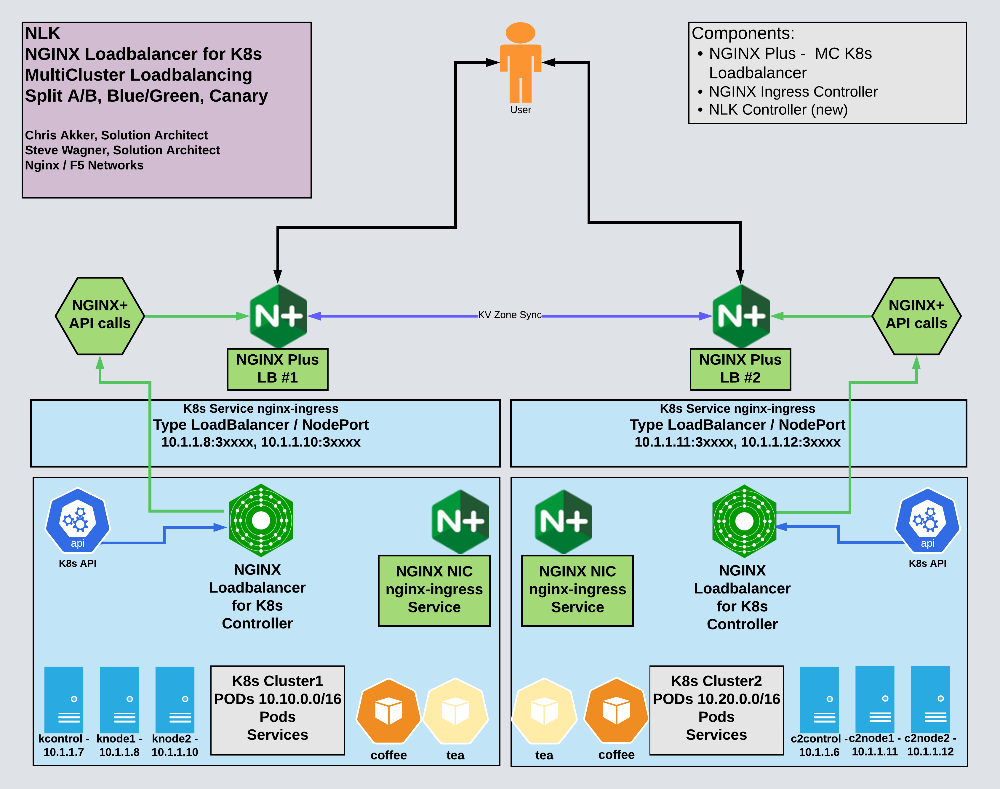

<br/>

## Installation Steps

1. Install NGINX Ingress Controller in your Cluster
2. Install NGINX Cafe Demo Application in your Cluster
3. Install NGINX Plus on the Loadbalancer Server(s) 
4. Configure NGINX Plus for HTTP MultiCluster Load Balancing
5. Install NLK NGINX Loadbalancer for Kubernetes Loadbalancing Controller in your Cluster
6. Install NLK LoadBalancer or NodePort Service manifest
7. Test out NLK
8. Test MultiCluster Load Balancing Solution
9. Optional - Monitor traffic with Prometheus / Grafana

<br/>

### Pre-Requisites

1. Working kubernetes clusters, with admin privleges
   
2. Running `nginx-ingress controller`, either OSS or Plus. This install guide followed the instructions for deploying an NGINX Ingress Controller here:  https://docs.nginx.com/nginx-ingress-controller/installation/installation-with-manifests/
   
3. Demo application, this install guide uses the NGINX Cafe example, found here:  https://github.com/nginxinc/kubernetes-ingress/tree/main/examples/ingress-resources/complete-example
   
4. A bare metal Linux server or VM for the external NGINX Loadbalancing Server, connected to a network external to the cluster.  Two of these will be required if High Availability is needed, as shown here.
   
5. NGINX Plus software loaded on the Loadbalancing Server(s). This install guide follows the instructions for installing NGINX Plus on Centos 7, located here: https://docs.nginx.com/nginx/admin-guide/installing-nginx/installing-nginx-plus/
   
6. The NGINX Loadbalancer for Kubernetes (NLK) Controller, new software from NGINX for this Solution.

<br/>

### Kubernetes Clusters

<br/>

### This Solution from NGINX provides Enterprise class features which address common challenges with networking, traffic management, and High Availability for On-Premises Kubernetes Clusters.

<br/>

1. Provides a `replacement Loadbalancer Service.`  The Loadbalancer Service is a key component provided by most Cloud Providers.  However, when running a K8s Cluster On Premises, the `Loadbalancer Service is not available.`  
This Solution provides a replacement, using an NGINX Server, and a new K8s Controller from NGINX.  These two components work together to watch the `nginx-ingress Service` in the cluster, and immediately update the NGINX Loadbalancing Server when changes occur.  

2. Provides `MultiCluster Load Balancing`, traffic steering, health checks, TLS termination, advanced Loadbalancing algorithms, and enhanced metrics.
   
3. Provides dynamic, ratio-based Load Balancing for Multiple Clusters. This allows for advanced traffic steering, and operation efficiency with no Reloads or downtime.
   - MultiCluster Active/Active Load Balancing
   - Horizontal Cluster Scaling
   - HTTP Split Clients - for A/B, Blue/Green, and Canary test and production traffic steering.  Allows Cluster operations/maintainence like upgrades, patching, expansion and troubleshooting
   - NGINX Zone Sync of KeyVal data
   - Advanced TLS Processing - MutualTLS, OCSP, FIPS, dynamic cert loading
   - Advanced Security features - App Protect WAF Firewall, Oauth, JWT, Dynamic Rate and Bandwidth limits, GeoIP, IP block/allow lists
   - NGINX Java Script (NJS) for custom solutions

<br/>

## Installation Steps

1. Install NGINX Ingress Controller in your Cluster
2. Install NGINX Cafe Demo Application in your Cluster
3. Install NGINX Plus on the Loadbalancing Server(s) 
4. Configure NGINX Plus for HTTP MultiCluster Load Balancing
5. Install NLK NGINX Loadbalancer for Kubernetes Controller in your Clusters
6. Install NLK LoadBalancer or NodePort Service manifest
7. Test and Verify NLK Functions
8. Test MultiCluster Load Balancing Solution
9. Optional - Monitor traffic with Prometheus / Grafana

<br/>

### Pre-Requisites

1. Working kubernetes clusters, with admin privleges
   
2. Running `nginx-ingress controller`, either OSS or Plus. This install guide followed the instructions for deploying an NGINX Ingress Controller here:  https://docs.nginx.com/nginx-ingress-controller/installation/installation-with-manifests/
   
3. Demo application, this install guide uses the NGINX Cafe example, found here:  https://github.com/nginxinc/kubernetes-ingress/tree/main/examples/ingress-resources/complete-example
   
4. A bare metal Linux server or VM for the external NGINX Loadbalancing Server, connected to a network external to the cluster.  Two of these will be required if High Availability is needed, as shown here.
   
5. NGINX Plus software loaded on the Loadbalancing Server(s). This install guide follows the instructions for installing NGINX Plus on Centos 7, located here: https://docs.nginx.com/nginx/admin-guide/installing-nginx/installing-nginx-plus/
   
6. The `NGINX Loadbalancer for Kubernetes (NLK) Controller`, new software from NGINX for this Solution.

<br/>

### Kubernetes Clusters

<br/>


<br/>

A standard K8s cluster is all that is required, two or more Clusters if you want the `Active/Active MultiCluster Load Balancing Solution` using HTTP Split Clients.  There must be enough resources available to run the NGINX Ingress Controller, and the NGINX Loadbalancer for Kubernetes Controller, and test application like the Cafe Demo.  You must have administrative access to be able to create the namespace, services, and deployments for this Solution.  This Solution was tested on Kubernetes version 1.23.

<br/>

## 1. Install NGINX Ingress Controller

<br/>


<br/>

The NGINX Ingress Controller in this Solution is the destination target for traffic (north-south) that is being sent to the cluster(s).  The installation of the actual Ingress Controller is outside the scope of this guide, but the links to the docs are included for your reference.  The `NIC installation using Manifests` must follow the documents exactly as written, as this Solution depends on the `nginx-ingress` namespace and service objects.  **Only the very last step is changed.**  

1. Follow these instructions to deploy the NGINX Ingress Controller into your cluster:  https://docs.nginx.com/nginx-ingress-controller/installation/installation-with-manifests/

   **NOTE:** This Solution only works with `nginx-ingress` from NGINX.  It will not work with the K8s Community version of Ingress, called ingress-nginx.  
   
1. If you are unsure which Ingress Controller you are running, check out the blog on nginx.com for more information:  
    
   https://www.nginx.com/blog/guide-to-choosing-ingress-controller-part-4-nginx-ingress-controller-options

<br/>

>Important!  Do not complete the very last step in the NIC deployment with Manifests, `do not deploy the loadbalancer.yaml or nodeport.yaml Service file!`  You will apply a different loadbalancer or nodeport Service manifest later, after the NLK Controller is up and running.  `The nginx-ingress Service file must be changed` - it is not the default file.  

<br/>

## 2. Install NGINX Cafe Demo Application

<br/>

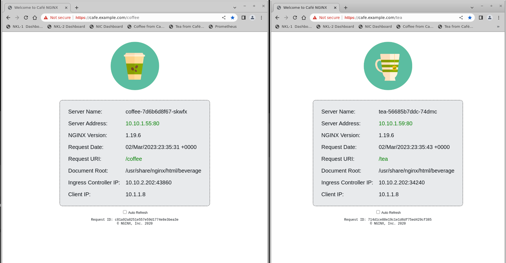

<br/>

This is not a component of the actual Solution, but it is useful to have a well-known application running in the cluster, as a known-good target for test commands.  The example provided here is used by the Solution to demonstrate proper traffic flows. 

Note: If you choose a different Application to test with, `the NGINX configurations and health checks provided here may not work,` and will need to be modified to work correctly.

<br/>

  1. Use the provided Cafe Demo manifests in the docs/cafe-demo folder:

      ```bash
      kubectl apply -f cafe-secret.yaml
      kubectl apply -f cafe.yaml
      kubectl apply -f cafe-virtualserver.yaml
      ```
      The Cafe Demo reference files are located here:
      
      https://github.com/nginxinc/kubernetes-ingress/tree/main/examples/ingress-resources/complete-example

  1. The Cafe Demo Docker image used here is an upgraded one, with simple graphics and additional TCP/IP and HTTP variables added.

      https://hub.docker.com/r/nginxinc/ingress-demo

   >Important!  - Do not use the `cafe-ingress.yaml` file.  Rather, use the `cafe-virtualserver.yaml` file that is provided here.  It uses the NGINX Plus CRDs to define a VirtualServer, and the related VirtualServer Routes needed.  If you are using NGINX OSS Ingress Controller, you will need to use the appropriate manifests, which is not covered in this Solution.

<br/>

## 3. Install NGINX Plus on LoadBalancing Server(s)

<br/>

### Linux VM or bare-metal Loadbalancing Server

 | 
--- | ---

<br/>

This can be any standard Linux OS system, based on the Linux Distro and Technical Specs required for NGINX Plus, which can be found here: https://docs.nginx.com/nginx/technical-specs/   

  1. This Solution followed the `Installation of NGINX Plus on Centos/Redhat/Oracle` steps for installing NGINX Plus.  

      https://docs.nginx.com/nginx/admin-guide/installing-nginx/installing-nginx-plus/

      >NOTE:  This Solution will only work with NGINX Plus, as NGINX OpenSource does not have the API that is used in this Solution.  Installation on unsupported Linux Distros is not recommended.

  1. Install the NGINX Javascript module (njs).  This is required for exporting Prometheus Metrics from NGINX Plus.
  
  ```bash
  yum install nginx-plus-module-njs
  ```

  1. If you need a license for NGINX Plus, a 30-day Trial license is available here:

      https://www.nginx.com/free-trial-request/

<br/>

## 4. Configure NGINX Plus for MultiCluster Load Balancing

<br/>

### This is the NGINX configuration required for the NGINX Loadbalancing Server, external to the cluster.  It must be configured for the following:

1. Move the NGINX default Welcome page from port 80 to port 8080.  Port 80 will be used by Prometheus in this Solution.
   
2. The NGINX NJS module is enabled, and configured to export the NGINX Plus statistics.
   
3. A self-signed TLS cert/key are used in this example for terminating TLS traffic for the Demo application, https://cafe.example.com.
   
4. Plus API with write access enabled on port 9000.  The Plus Dashboard is also enabled, used for testing, monitoring, and visualization of the Solution working.

5. The `http` context is used for MultiCluster Loadbalancing, for HTTP/S processing, Split Clients ratio.  The Plus Key Value Store is configured, to hold the dynamic Split ratio metadata.

6. Enable Prometheus metrics exporting.

7. Plus Zone Sync on Port 9001 is configured, to synchronize the dynamic KeyVal data between multiple NGINX Loadbalancing Servers.

<br/>

### Overview of the Config Files used for the NGINX Plus Loadbalancing Servers:

<br/>

For easy installation/configuration, Git Clone this repository onto the Loadbalancing Server, it contains all the example files that are used here.

```bash
https://github.com/nginxinc/nginx-loadbalancer-kubernetes.git
```

Nginx Config Files

```bash
etc/
└── nginx/
    ├── conf.d/
    │   ├── clusters.conf.......... MultiCluster Loadbalancing and split clients config
    │   ├── dashboard.conf......... NGINX Plus API and Dashboard config
    │   ├── default-http.conf...... New default.conf config
    │   └── prometheus.conf........ NGINX Prometheus config
    ├── nginx.conf................. New nginx.conf
    └── stream
        └── zonesync.conf.......... NGINX Zone Sync config 
```

<br/>

After a new installation of NGINX Plus, make the following configuration changes:

1. Change NGINX's http default server to port 8080.  See the included `default-http.conf` file.  After reloading nginx, the default `Welcome to NGINX` page will be located at http://localhost:8080.

    ```bash
    cat /etc/nginx/conf.d/default.conf
    # NGINX Loadbalancer for Kubernetes Solution
    # Chris Akker, Apr 2023
    # Example default.conf
    # Change default_server to port 8080
    #
    server {
        listen       8080 default_server;   # Changed to 8080
        server_name  localhost;

        #access_log  /var/log/nginx/host.access.log  main;

        location / {
            root   /usr/share/nginx/html;
            index  index.html index.htm;
        }

        #error_page  404              /404.html;

        # redirect server error pages to the static page /50x.html
        #
        error_page   500 502 503 504  /50x.html;
        location = /50x.html {
            root   /usr/share/nginx/html;
        }

    ### other sections removed for clarity

    }

    ```

1. Use the included nginx.conf file, it enables the NGINX NJS module, for exporting the Plus statistics:  

    ```bash
    cat /etc/nginx/nginx.conf

    # NGINX Loadbalancer for Kubernetes Solution
    # Chris Akker, Apr 2023
    # Example nginx.conf
    # Enable Prometheus NJS module, increase output buffer size
    # Enable Stream context, add /var/log/nginx/stream.log
    #
    user  nginx;
    worker_processes  auto;

    error_log  /var/log/nginx/error.log notice;
    pid        /var/run/nginx.pid;

    load_module modules/ngx_http_js_module.so;   # Added for Prometheus

    worker_rlimit_nofile 2048;

    events {
        worker_connections 2048;
    }

    http {
        include       /etc/nginx/mime.types;
        default_type  application/octet-stream;

        log_format  main  '$remote_addr - $upstream_addr - $upstream_status - $remote_user [$time_local] $host - "$request" '
                          '$status $body_bytes_sent "$http_referer" '
                          '"$http_user_agent" "$http_x_forwarded_for"';

        access_log  /var/log/nginx/access.log  main;

        sendfile        on;
        #tcp_nopush     on;

        keepalive_timeout  65;

        #gzip  on;

        include /etc/nginx/conf.d/*.conf;

        subrequest_output_buffer_size 32k;   #added for Prometheus

    }

    # TCP/UDP proxy and load balancing block
    #
    stream {

      include  /etc/nginx/stream/*.conf;

      log_format  stream  '$remote_addr - $server_addr [$time_local] $status $upstream_addr $upstream_bytes_sent';

      access_log  /var/log/nginx/stream.log  stream;
    }

    ```

1. Configure NGINX for TLS traffic processing, MultiCluster load balancing with HTTP Split Clients for this Solution.

    `Notice that this example Solution only uses port 443 and terminates TLS.`  
  
    If you need a self-signed TLS cert/key, use openssl, and place both files in the /etc/ssl/nginx folder.
  
    ```bash
    openssl req -x509 -nodes -days 365 -newkey rsa:2048 -keyout default.key -out default.crt -subj "/CN=NLK"
    ```

1. Enable the NGINX Plus dashboard.  Use the `dashboard.conf` file provided.  It will enable the /api endpoint, change the port to 9000, and provide access to the Plus Dashboard.  Note:  There is no security for the /api endpoint in this example config, it should be secured as approprite with TLS or IP allow list.  Place this file in the /etc/nginx/conf.d folder, and reload nginx.  The Plus dashboard is now accessible at http://nginx-lb-server-ip:9000/dashboard.html.  It should look similar to this:

    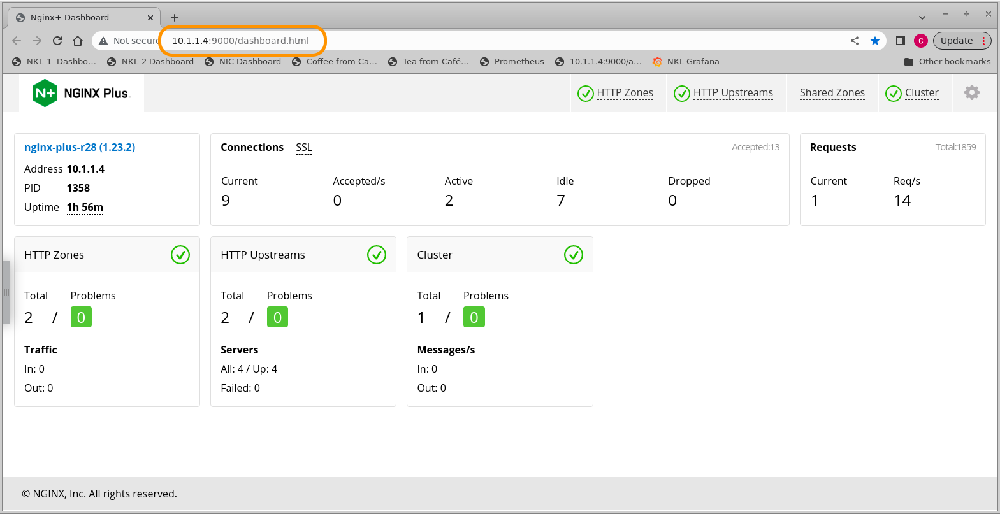
  
1. Configure **HTTP MultiCluster Loadbalancing**.  Place the `clusters.conf` file in the /etc/nginx/conf.d folder, and reload NGINX.  Notice the match block and health check directives are for the cafe.example.com Demo application from NGINX.  The Key Value Store is configured to hold the Split Ratio.

    ```bash
    cat /etc/nginx/conf.d/clusters.conf

    # NGINX Loadbalancer for Kubernetes HTTP configuration, for L7 load balancing
    # Chris Akker, Apr 2023
    # HTTP Proxy and load balancing
    # MultiCluster Load Balancing with http split clients 0-100%
    # Upstream servers managed by NLK Controller
    # NGINX Key Value store for Split ratios
    #
    #### clusters.conf

    # Define Key Value store, backup state file, timeout, and enable sync

    keyval_zone zone=split:1m state=/var/lib/nginx/state/split.keyval timeout=30d sync;
    keyval $host $split_level zone=split;

    # Main NGINX Server Block for cafe.example.com, with TLS

    server {
      listen 443 ssl;
      status_zone https://cafe.example.com;
      server_name cafe.example.com;
      
      ssl_certificate /etc/ssl/nginx/default.crt;  # self-signed for example only
      ssl_certificate_key /etc/ssl/nginx/default.key;
      
      location / {
      status_zone /;
      
      proxy_set_header Host $host;
      proxy_http_version 1.1;
      proxy_set_header   "Connection" "";
      proxy_pass https://$upstream;
      
      }

      location @health_check_cluster1_cafe {

      health_check interval=10 match=cafe;
      proxy_connect_timeout 2s;
      proxy_read_timeout 3s;
      proxy_set_header Host cafe.example.com;
      proxy_pass https://cluster1-https;
      }
    
      location @health_check_cluster2_cafe {

      health_check interval=10 match=cafe;
      proxy_connect_timeout 2s;
      proxy_read_timeout 3s;
      proxy_set_header Host cafe.example.com;
      proxy_pass https://cluster2-https;
      }
    }

    match cafe {
      status 200-399;
      }

    # Cluster1 upstreams

    upstream cluster1-https {
      zone cluster1-https 256k;
      least_time last_byte;        # advanced NGINX Loadbalancing algorithm
      keepalive 16;
      #servers managed by NLK Controller
      state /var/lib/nginx/state/cluster1-https.state; 
    }

    # Cluster2 upstreams

    upstream cluster2-https {
      zone cluster2-https 256k;
      least_time last_byte;        # advanced NGINX Loadbalancing algorithm
      keepalive 16;
      #servers managed by NLK Controller
      state /var/lib/nginx/state/cluster2-https.state; 
    }

    # HTTP Split Clients Configuration for Cluster1:Cluster2 ratios
    # Ratios provided:  0,1,5,10,25,50,75,90,95,99,100%

    split_clients $request_id $split0 { 
      * cluster2-https;
      }

    split_clients $request_id $split1 { 
      1.0% cluster1-https;
      * cluster2-https;
      }

    split_clients $request_id $split5 {
      5.0% cluster1-https;
      * cluster2-https;
      }

    split_clients $request_id $split10 { 
      10% cluster1-https;
      * cluster2-https;
      }

    split_clients $request_id $split25 { 
      25% cluster1-https;
      * cluster2-https;
      }

    split_clients $request_id $split50 { 
      50% cluster1-https;
      * cluster2-https;
      }

    split_clients $request_id $split75 { 
      75% cluster1-https;
      * cluster2-https;
      }

    split_clients $request_id $split90 {
      90% cluster1-https;
      * cluster2-https;
      }
      
    split_clients $request_id $split95 {
      95% cluster1-https;
      * cluster2-https;
      }
      
    split_clients $request_id $split99 {
      99% cluster1-https;
      * cluster2-https;
      }

    split_clients $request_id $split100 {
      * cluster1-https;
      }

    map $split_level $upstream { 
      0 $split0;
      1.0 $split1;
      5.0 $split5;
      10 $split10;
      25 $split25;
      50 $split50;
      75 $split75;
      90 $split90;
      95 $split95;
      99 $split99;
      100 $split100;
      default $split50;
      }

    ```

1. Configure NGINX for the Prometheus scraper page, which exports the Plus statistics.  Place the `prometheus.conf` file in /etc/nginx/conf.d folder and reload NGINX.

    ```bash
    cat /etc/nginx/conf.d/prometheus.conf

    # NGINX Loadbalancer for Kubernetes Prometheus configuration, for HTTP scraper page
    # Chris Akker, Apr 2023
    # https://www.nginx.com/blog/how-to-visualize-nginx-plus-with-prometheus-and-grafana/
    #
    #### prometheus.conf

    js_import /usr/share/nginx-plus-module-prometheus/prometheus.js;

    server {
        location = /metrics {
            js_content prometheus.metrics;
        }

        location /api {
            api;
        } 

    }

    ```

1. High Availability:  If you have 2 or more NGINX Plus Loadbalancing Servers, you can use Zone Sync to synchronize the KeyValue SplitRatio data between the NGINX Loadbalancing Servers automatically.  Use the `zonesync.conf` example file provided, change the IP addresses to match your NGINX Loadbalancing Servers.  Place this file in /etc/nginx/stream folder on each Loadbalancing Server, and reload NGINX.  Note:  This example does not provide any security for the Zone Sync traffic, secure as necessary with TLS or IP allowlist.

    ```bash
    cat zonesync.conf

    # NGINX Loadbalancer for Kubernetes Zone Sync configuration, for KeyVal split
    # Chris Akker, Apr 2023
    # Stream Zone Sync block
    # 2 NGINX Plus nodes
    # NGINX Loadbalancer for Kubernetes
    # https://docs.nginx.com/nginx/admin-guide/high-availability/zone_sync/
    #
    #### zonesync.conf

    server {
      zone_sync;

      listen 9001;

      # Zone Sync with 2 nodes
      zone_sync_server 10.1.1.4:9001;
      zone_sync_server 10.1.1.5:9001;

      }

    ```

   Checking the NGINX Plus Dashboard, Cluster Tab, you will see the Status of the `split` Zone as Green, and messages sent/received if Zone Sync is operating correctly:

    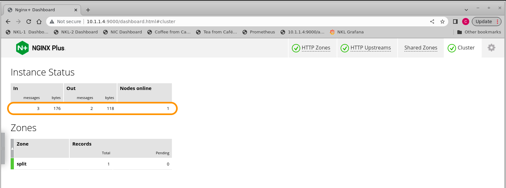

<br/>

## 5. Install NLK - NGINX Loadbalancer for Kubernetes Controller

<br/>


<br/>

### This is the new K8s Controller from NGINX, which is configured to watch the k8s environment, the `nginx-ingress` Service object, and send API updates to the NGINX Loadbalancing Server(s) when there are changes.  It only requires three things:

1. New Kubernetes namespace and RBAC
2. NLK ConfigMap, to configure the Controller
3. NLK Deployment, to deploy and run the Controller

<br/>

1. Create the new `nlk` K8s namespace:

    ```bash
    kubectl create namespace nlk
    ```

1. Apply the manifests for NLK's Secret, Service, ClusterRole, and ClusterRoleBinding:

    ```bash
    kubectl apply -f secret.yaml serviceaccount.yaml clusterrole.yaml clusterrolebinding.yaml
    ```

1. Modify the ConfigMap manifest to match your NGINX Loadbalancing Server(s). Change the `nginx-hosts` IP address to match your NGINX Loadbalancing Server IP.  If you have 2 or more Loadbalancing Servers, separate them with a comma.  Important! - keep the port number for the Plus API endpoint, and the `/api` URL as shown.

    ```yaml
    apiVersion: v1
    kind: ConfigMap
    data:
      nginx-hosts:
        "http://10.1.1.4:9000/api,http://10.1.1.5:9000/api" # change IP(s) to match NGINX Loadbalancing Server(s)
    metadata:
      name: nlk-config
      namespace: nlk
    ```

1. Apply the updated ConfigMap:

    ```bash
    kubectl apply -f nlk-configmap.yaml
    ```

1. Deploy the NLK Controller:

    ```bash
    kubectl apply -f nlk-deployment.yaml
    ```

1. Check to see if the NLK Controller is running, with the updated ConfigMap:

    ```bash
    kubectl get pods -n nlk
    ```
    ```bash
    kubectl describe cm nlk-config -n nlk
    ```

    The status should show "running", your `nginx-hosts` should have the Loadbalancing Server IP:Port/api defined.

    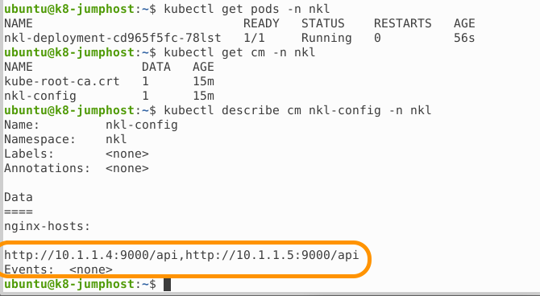

1. To make it easy to watch the NLK Controller's log messages, add the following bash alias:

    ```bash
    alias nlk-follow-logs='kubectl -n nlk get pods | grep nlk-deployment | cut -f1 -d" "  | xargs kubectl logs -n nlk --follow $1'
    ```

    Using a new Terminal, you can watch the NLK Controller log:

    ```bash
    nlk-follow-logs
    ```

    Leave this Terminal window open, so you can watch the log messages.

<br/>

## 6. Install NLK LoadBalancer or NodePort Service Manifest

<br/>

Select which Service Type you would like, and follow the appropriate steps below.  Do not use both the LoadBalancer and NodePort Service files at the same time.

Use the `loadbalancer-cluster1.yaml` or `nodeport-cluster1.yaml` manifest file that is provided here with this Solution.  The "ports name" in the manifests `MUST` be in the correct format for this Solution to work correctly.  
>**`The port name is the mapping from NodePorts to the Loadbalancing Server's upstream blocks.`**  The port names are intentionally changed to avoid conflicts with other NodePort definitions.

<br/>

From the Git Repo, reference the provided Kubernetes Config Files

``` bash
nginx-loadbalancer-kubernetes/
└── docs/
    └── http/
        ├── grafana-dashboard.json............ NGINX Plus Grafana dashboard
        ├── loadbalancer-cluster1.yaml........ LoadBalancer manifest for Cluster1
        ├── loadbalancer-cluster2.yaml........ LoadBalancer manifest for Cluster2
        ├── nodeport-cluster1.yaml............ NodePort manifest for Cluster1
        ├── nodeport-cluster2.yaml............ NodePort manifest for Cluster2
        └── prometheus.yml.................... Prometheus container config
```

<br/>

### If you want to run a Service Type LoadBalancer

1. Review the `loadbalancer-cluster1.yaml` file:

    ```yaml
    # NLK LoadBalancer Service file
    # Spec -ports name must be in the format of
    # nlk-<upstream-block-name>
    # The nginxinc.io Annotation must be added
    # externalIPs are set to NGINX Loadbalancing Servers
    # Chris Akker, Apr 2023
    #
    apiVersion: v1
    kind: Service
    metadata:
      name: nginx-ingress
      namespace: nginx-ingress
      annotations:
        nginxinc.io/nlk-cluster1-https: "http"   # Must be added
    spec:
      type: LoadBalancer
      externalIPs:
      - 10.1.1.4
      - 10.1.1.5 
      ports:
      - port: 443
        targetPort: 443
        protocol: TCP
        name: nlk-cluster1-https     # Must match NGINX upstream name
      selector:
        app: nginx-ingress

    ```

1. Apply the NLK Compatible LoadBalancer `loadbalancer-cluster1.yaml` Service Manifest:

    ```bash
    kubectl apply -f loadbalancer-cluster1.yaml
    ```

    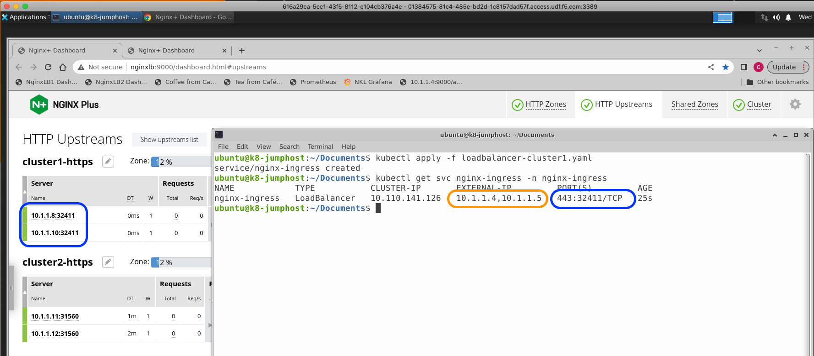

    Legend:
    - Orange is the LoadBalancer Service `External-IP`, which are your NGINX Loadbalancing Server IP(s).
    - Blue is the `NodePort mapping` created by K8s.  The new NLK Controller updates the NGINX Loadbalancing Server upstreams with these, shown on the dashboard.

<br/>

**NOTE:** If you have a second K8s cluster, and you want to Load Balance both Clusters using the MultiCluster Solution, repeat the previous setup on your second cluster.  

**IMPORTANT:  Do not mix and match loadbalancer-clusterX.yaml files!**  

- `loadbalancer-cluster1.yaml` must be used for Cluster1
- `loadbalancer-cluster2.yaml` must be used for Cluster2
- The Port name definitions must match each cluster's upstream name exactly, minus the `nlk-` prefix.
- Port name and manifest files must match the target cluster for the NLK Controller, and HTTP Split Clients dynamic ratio configuration to work correctly.  
- It is highly recommended that you configure, test, and verify traffic is flowing correctly on Cluster1, before you add Cluster2.  
- Be aware of and properly set your `./kube Config Context`, before applying one of these LoadBalancer definitions.

<br/>

### Alternatively, if you want a Service Type NodePort

1. Review the new `nodeport-cluster1.yaml` Service defintion file:

    ```yaml
    # NLK Nodeport Service file
    # NodePort -ports name must be in the format of
    # nlk-<upstream-block-name>
    # The nginxinc.io Annotation must be added
    # Chris Akker, Apr 2023
    #
    apiVersion: v1
    kind: Service
    metadata:
      name: nginx-ingress
      namespace: nginx-ingress
      annotations:
        nginxinc.io/nlk-cluster1-https: "http"   # Must be added
    spec:
      type: NodePort 
      ports:
      - port: 443
        targetPort: 443
        protocol: TCP
        name: nlk-cluster1-https
      selector:
        app: nginx-ingress

    ```

1. Create the NLK compatible NodePort Service, using the `nodeport-cluster1.yaml` manifest provided:

    ```bash
    kubectl apply -f nodeport-cluster1.yaml
    ```

1. Verify that the `nginx-ingress` NodePort Service is properly defined:

    ```bash
    kubectl get svc nginx-ingress -n nginx-ingress
    ```

    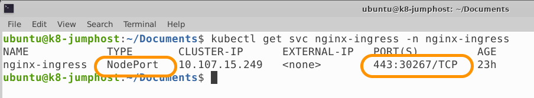
    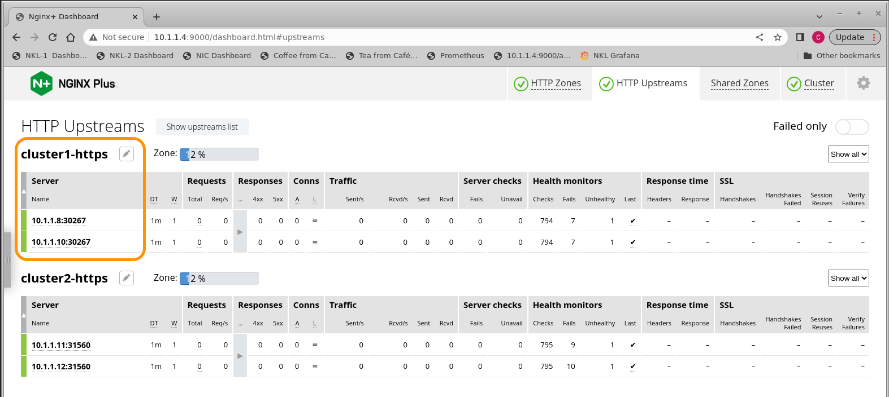

### NodePort mapping is 443:30267,  K8s Workers are 10.1.1.8 and .10.

<br/>

**NOTE:** If you have a second K8s cluster, and you want to Load Balance both Clusters using the MultiCluster Solution, repeat the appropriate setup on your second cluster.  

**IMPORTANT:  Do not mix and match nodeport-clusterX.yaml files.**  

- `nodeport-cluster1.yaml` must be used for Cluster1
- `nodeport-cluster2.yaml` must be used for Cluster2
- The NodePort definitions must match each cluster upstream name exactly.
- Nodeports and manifest files must match the target cluster for the NLK Controller and HTTP Split Clients dynamic ratio configuration to work correctly.  
- It is highly recommended that you configure, test, and verify traffic is flowing correctly on Cluster1, before you add Cluster2.  
- Be aware of and properly set your `./kube/config Config Context`, before applying one of these nodeport definitions.

<br/>

## 7. Testing NLK NGINX Loadbalancer for Kubernetes

<br/>

When you are finished, the NGINX Plus Dashboard on the Loadbalancing Server(s) should look similar to the following image:

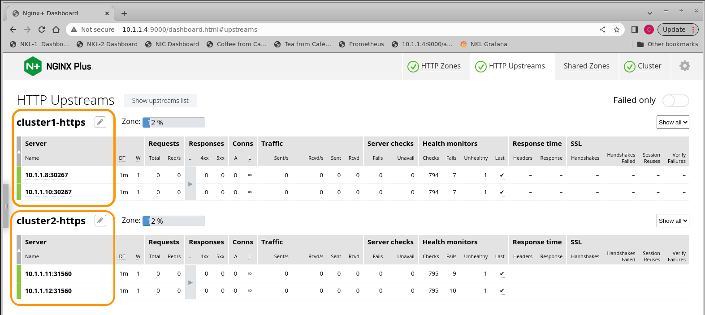

Important items for reference:
- Orange are the upstream server blocks, from the `etc/nginx/conf.d/clusters.conf` file.
- If both NLK Controllers are working, it will update the correct `clusterX-https` upstream block. 
- The IP addresses will match the K8s worker nodes, the port numbers will match the NodePort definitions for nginx-ingress Service from each cluster.

>Note: In this example, there is a 3-Node K8s cluster, with one Control Node, and 2 Worker Nodes.  The NLK Controller only configures NGINX upstreams with `Worker Node` IP addresses, from Cluster1, which are:

- 10.1.1.8
- 10.1.1.10

Cluster2 Worker Node addresses are:
- 10.1.1.11
- 10.1.1.12

Note: K8s Control Nodes are excluded from the list intentionally.

<br/>

1. Configure DNS, or the local hosts file, for cafe.example.com > NGINXLoadbalancing Server IP Address.  In this example:

    ```bash
    cat /etc/hosts

    10.1.1.4 cafe.example.com
    ```

1. Open a browser tab to https://cafe.example.com/coffee.  

    The Dashboard's `HTTP Upstreams Requests counters` will increase as you refresh the browser page.

1. Using a Terminal and `./kube Context set for Cluster1`, delete the `nginx-ingress loadbalancer service` or `nginx-ingress nodeport service` definition.  

    ```bash
    kubectl delete -f loadbalancer-cluster1.yaml
    ```
    or
    ```bash
    kubectl delete -f nodeport-cluster1.yaml
    ```

    Now the `nginx-ingress` Service is gone, and the Cluster1 upstream list will now be empty in the Dashboard.  The NLK Logs will show that it has `DELETED` the upstream servers!

    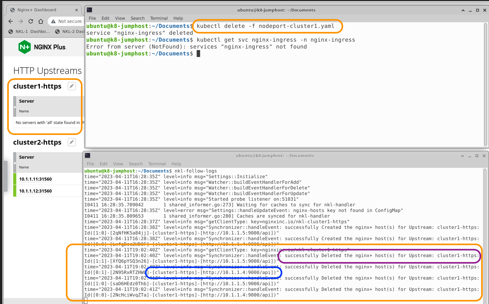
    Legend:
    - Orange highlights the Cluster1 and NodePort are deleted.
    - Indigo highlights the NLK Controller log message, successfully deleting the cluster1-https upstreams.
    - Blue highlights the actual API calls to the Loadbalancing Server, 10.1.1.4.
    - Notice there are 4 Deleted Log messages, 2 Worker Nodes X 2 Loadbalancing Servers.
    - If you are running a second NGINX Loadbalancing Server for HA, and Zone Sync is working, the cluster1-https upstreams on Loadbalancing Server#2 will also be empty.  Check the Loadbalancing Server#2 Dashboard to confirm.

1. If you refresh the cafe.example.com browser page, 1/2 of the requests will respond with `502 Bad Gateway`.  There are NO upstreams in Cluster1 for NGINX to send the requests to!


2. Add the `nginx-ingress` Service back to Cluster1:

    ```bash
    kubectl apply -f loadbalancer-cluster1.yaml
    ```
    or
    ```bash
    kubectl apply -f nodeport-cluster1.yaml
    ```

1. Verify the nginx-ingress Service is re-created.  Notice the the Port Numbers have changed!

    ```bash
    kubectl get svc nginx-ingress -n nginx-ingress
    ```

`The NLK Controller detects this change, and modifies the Loadbalancing Server(s)  upstreams to match.`  The Dashboard will show you the new Port numbers, matching the new LoadBalancer or NodePort definitions.  The NLK logs show these messages, confirming the changes:

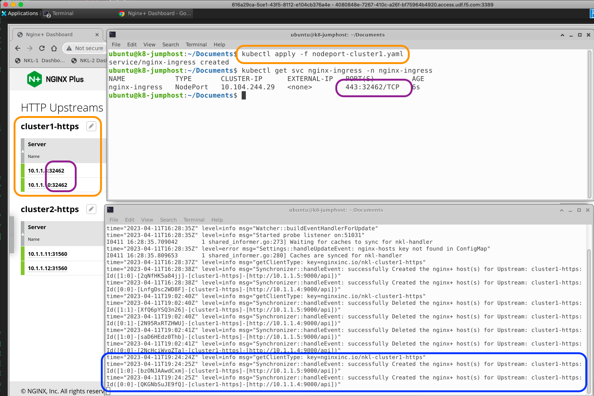

<br/>

### MultiCluster Solution

If you plan to implement and test the MultiCluster Load Balancing Solution, repeat all the steps to configure the second K8s cluster, identical to the first Cluster1 steps.  
- There is only one change - you MUST use the appropriate `loadbalancer-clusterX.yaml` or `nodeport-clusterX.yaml` manifest to match the appropriate cluster.
- Don't forget to check and set your ./kube Config Context when you change clusters!  
- Test and Verify that the NLK Controller in Cluster2 should be updating the `cluster2-https` upstreams.

<br/>

## 8. Testing MultiCluster Loadbalancing with HTTP Split Clients

<br/>

In this section, you will generate some HTTP load on the NGINX Loadbalancing Server, and watch as it sends traffic to both Clusters.  Then you will `dynamically change the HTTP Split ratio`, and watch NGINX send different traffic percentages to each cluster.

In these test examples, the NGINX Loadbalancing Servers and IPs in the hosts file are:

```bash
cat /etc/hosts

nginxlb  10.1.1.4
nginxlb2 10.1.1.5
```

The only tool you need for this, is an HTTP/S load generation tool.  WRK, running in a docker container outside the cluster is used and shown here.

1. Start WRK, on a client outside the cluster.  This command runs WRK for 15 minutes, targets the NGINX Loadbalancing Server URL of https://10.1.1.4/coffee.  The Host header is required, cafe.example.com, as NGINX is configured for this server_name. (And so is the NGINX Ingress Controller).

    ```bash
    docker run --rm williamyeh/wrk -t2 -c200 -d15m -H 'Host: cafe.example.com' --timeout 2s https://10.1.1.4/coffee
    ```

    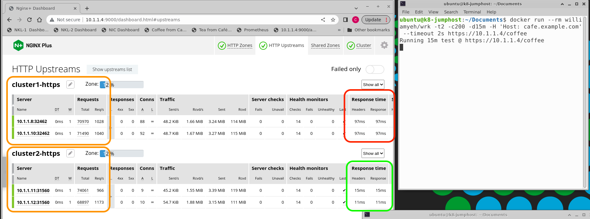

    You see the traffic is load balanced between cluster1 and cluster2 at a 50:50 ratio.  

1. Add a new record to the KeyValue store, by sending an API command to NGINX Plus:

    ```bash
    curl -iX POST -d '{"cafe.example.com":50}' http://nginxlb:9000/api/8/http/keyvals/split
    ```

1. Verify the `split KeyVal record` is there, on both NGINX Loadbalancing Servers:

    ```bash
    curl http://nginxlb:9000/api/8/http/keyvals/split
    curl http://nginxlb2:9000/api/8/http/keyvals/split
    ```

    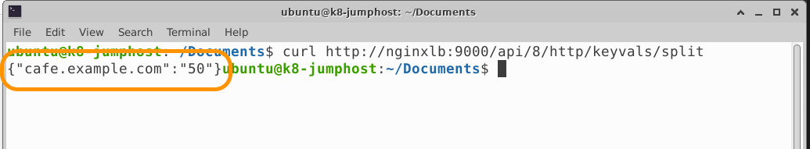

    If the KeyVal data is missing on one Loadbalancing Server, your Zone Sync is not working and must be fixed.

    >Check the traffic stats on the Plus Dashboard.  Notice the difference in `HTTP Response Times` in the Dashboard, highlighted in Red and Green: Cluster2 is responding much faster than Cluster1!  (The Red and Green highlights on the Dashboard).

    Given this, you decide to send less traffic to Cluster1, and more to Cluster2.  You will set the HTTP Split ratio to 10:90 = 10% to Cluster1, 90% to Cluster2.

    Remember:  This Split Clients example configures NGINX for Cluster1 to use the Split KeyValue, and the remaining percentage of traffic is sent to Cluster2.

1. Change the KeyVal Split Ratio to 10, using an HTTP PATCH Method to update the KeyVal record in memory:

    ```bash
    curl -iX PATCH -d '{"cafe.example.com":10}' http://nginxlb:9000/api/8/http/keyvals/split
    ```

    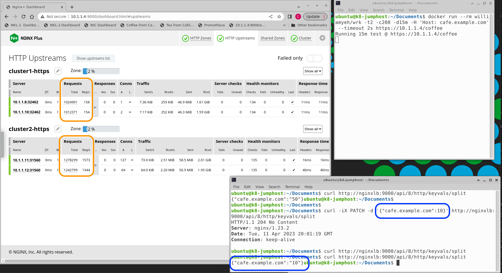

    **Important NOTE:**  The first time, an `HTTP POST` is required to ADD a new record to the KeyValue store.  Once the record exists, use an `HTTP PATCH` method to update an existing record, which will change the ratio value in KeyVal memory, dynamically.  NGINX sees this change, and applies it with no reloads or restarts of NGINX required!

1. Try a few more ratios, see how it works.  If you review the `clusters.conf` file, you will discover what Ratios are provided for you.  You can edit these to suit your needs.  Also notice the Map directive has a "default" set to "50".  So if the Value is blank or set incorrectly, it will Split at a default ratio of 50:50.

    As you can see, if you set the Ratio to "0", `Cluster1 receives NO TRAFFIC`, and you can perform K8s maintenance, troubleshooting, upgrades, etc, with no impact to live traffic.  Alternatively, you can set the Ratio to "100", and now `Cluster2 receives NO TRAFFIC`, and you can work on that cluster - with NO disruption to traffic and downtime required.

1. Set the Split back to "50" when your testing is completed, and ask the boss for a raise.

The Completes the Testing Section.

</br>

## 9. Prometheus and Grafana Servers

<br/>

  |
--- | ---

### During the testing of the Solution, it is helpful to see the load balancing and HTTP Split Ratios visually, using a chart or graph over time.

<br/>

Here are the instructions to run 2 Docker containers on a Monitor Server, which will collect the NGINX Plus statistics from Prometheus, and graph them with Grafana.  Likely, you already have these running in your environment, but are provided here as an example to display the NGINX metrics of high value.

<br/>

### Prometheus

<br/>

1. Configure your Prometheus server to collect NGINX Plus statistics from the scraper page.  Use the prometheus.yml file provided, edit the IP addresses to match your NGINX Loadbalancing Server(s).

    ```bash
    cat prometheus.yaml
    ```

    ```yaml
    global:
      scrape_interval: 15s 
      
      external_labels:
        monitor: 'nginx-monitor'
    
    scrape_configs:  
      - job_name: 'prometheus'
        
        scrape_interval: 5s
    
        static_configs:
          - targets: ['10.1.1.4:80', '10.1.1.5:80']  # NGINX Loadbalancing Servers
    ```

1. Review, edit and place the sample `prometheus.yml` file in /etc/prometheus folder.

1. Start the Prometheus docker container:

    ```bash
    sudo docker run --restart always --network="host" -d -p 9090:9090 --name=prometheus -v ~/prometheus.yml:/etc/prometheus/prometheus.yml prom/prometheus
    ```

1. Prometheus Web Console access to the data is on http://<monitor-server-ip:9090>.

    Explore some of the metrics available.  Try a query for `nginxplus_upstream_server_response_time`:

    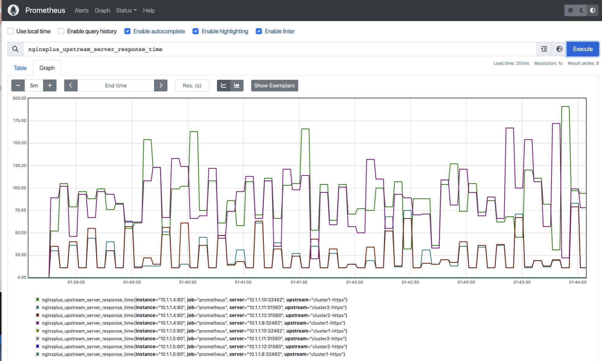

    >Wow, look at the variance in performance / response time!

<br/>

### Grafana 

<br/>

1. Create a docker volume to store the Grafana data.

    ```bash
    docker volume create grafana-storage
    ```

1. Start the Grafana docker container:

    ```bash
    sudo docker run --restart always -d -p 3000:3000 --name=grafana -v grafana-storage:/var/lib/grafana grafana/grafana
    ```

1. Web console access to Grafana is on http://<monitor-server-ip:3000>.  Login is admin/admin.

1. You can import the provided `grafana-dashboard.json` file to see the NGINX Plus `Cluster1 and 2 statistics` HTTP RPS and Upstream Response Times.

<br/>

### For example, here are four Grafana Charts of the MultiCluster Solution, under load with WRK, as detailed above in the Testing Section:

- The Split ratio was started at 50%.  Then it was changed to `10` using the Plus API at 12:56:30.  And then change to `90` 3 minutes later at 12:59:30.
- The first graph is Split Ratio=50, second graph is Split Ratio=10, and third graph is Split Ratio=90.
- The fourth graph is the HTTP Response Time from both Clusters ... why is Cluster2 so much faster than Cluster1 ???  Good thing NGINX provides way to monitor and adjust the traffic based on real-time metrics :-)

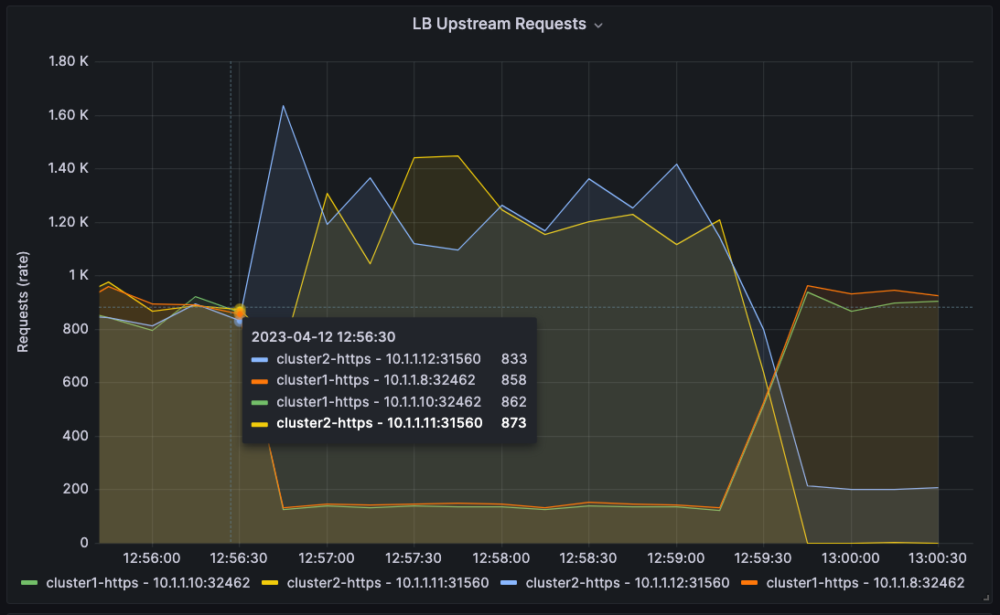
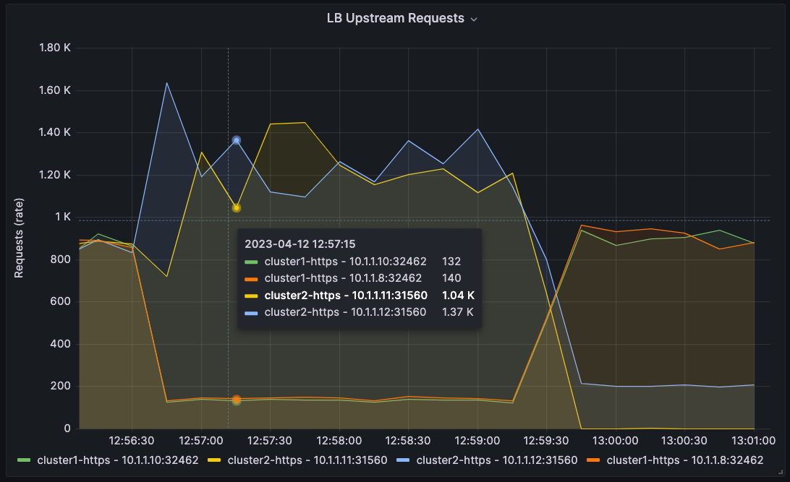
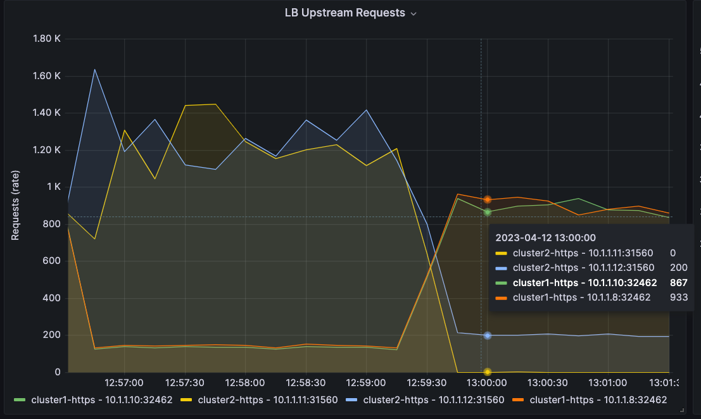

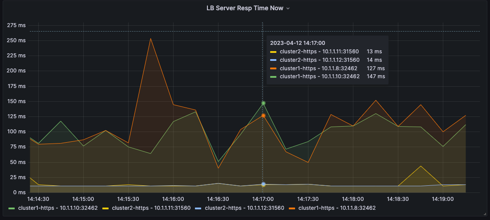

<br/>

### End of Prometheus and Grafana Section

<br/>

## References ##

[NGINX Ingress Controller](https://docs.nginx.com/nginx-ingress-controller/)
[NGINX Cafe Demo](https://github.com/nginxinc/kubernetes-ingress/tree/main/examples/ingress-resources/complete-example)
[Installing NGINX Plus](https://docs.nginx.com/nginx/admin-guide/installing-nginx/installing-nginx-plus/)
[NGINX Loadbalancer for Kubernetes Overview](https://github.com/nginxinc/nginx-loadbalancer-kubernetes/tree/main/docs)
[NGINX Split Clients Module](https://nginx.org/en/docs/http/ngx_http_split_clients_module.html)
[NGINX Dynamic Split Clients Blog](https://www.nginx.com/blog/dynamic-a-b-testing-with-nginx-plus/)
[NGINX njs Module](https://docs.nginx.com/nginx/admin-guide/dynamic-modules/nginscript/)
[Prometheus](https://prometheus.io/)
[Grafana](https://grafana.com/)

<br/>

## Authors
- Chris Akker - Solutions Architect - Community and Alliances @ F5, Inc.
- Steve Wagner - Solutions Architect - Community and Alliances @ F5, Inc.
