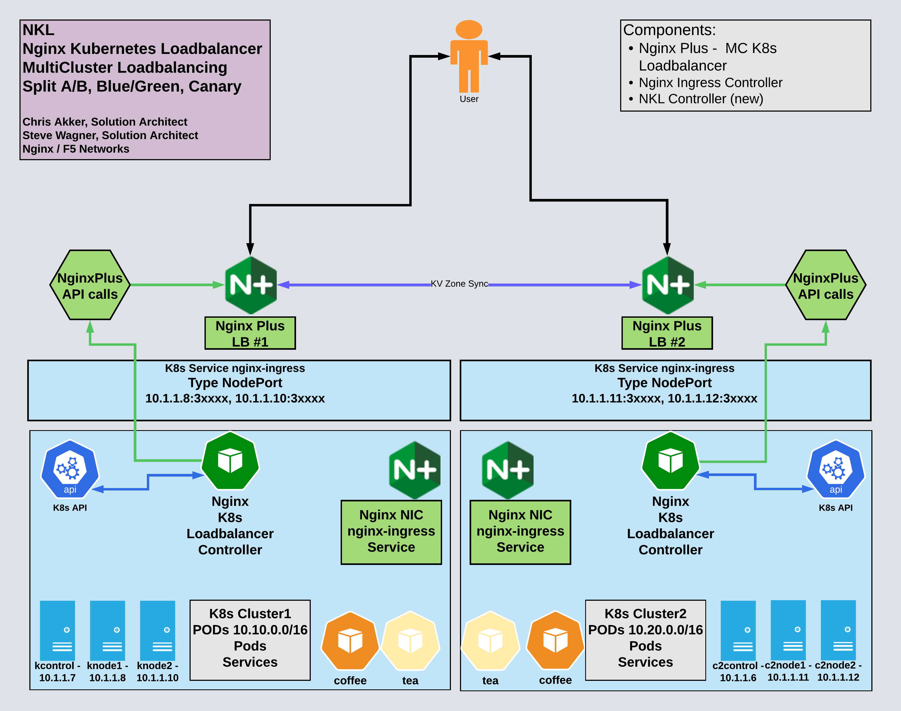

## NKL and MultiCluster Load Balancing with HTTP/S

 

## Overview

 

>With the Nginx Plus Servers located external to the Cluster, using Nginx's advanced HTTP/S features provide Enterprise traffic management solutions.
  
- MultiCluster Active/Active Load Balancing
- Horizontal Cluster Scaling
- HTTP Split Clients - for `A/B, Blue/Green, and Canary` test and production traffic steering.  Allows Cluster operations/maintainence like:
  - Node upgrades
  - Software upgrades/security patches
  - Cluster resource expansions
  - Troubleshooting
  - ^^ With NO downtime or reloads
- Nginx Zone Sync of KeyVal data
- API Gateway functions
- Advanced TLS Processing - MutualTLS, OCSP, FIPS, dynamic cert loading
- Advanced Security features - App Protect WAF Firewall, Oauth, JWT, Dynamic Rate and Bandwidth limits, GeoIP, IP block/allow lists
- Nginx Java Script (NJS) for custom solutions

 

## Reference Diagram for NKL HTTP Load Balancer Service

 

Multiple K8s Clusters, HA Nginx Plus LB, NKL Controllers

 

NKL Watching NodePort and Updating HTTP Upstreams

 

MultiCluster Load Balancing

 

Nginx HTTP Split Clients with Dynamic Ratio -- 10% Cluster1 : 90% Cluster2 

 

The `Installation Guide` for HTTP MultiCluster Solution is located in the docs/http folder:

[HTTP MultiCluster Loadbalancing Guide](../http/http-installation-guide.md)

 
