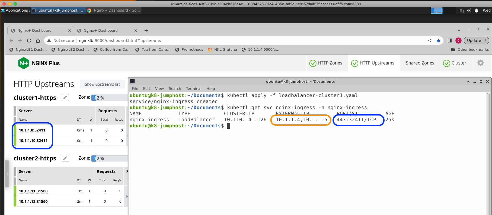
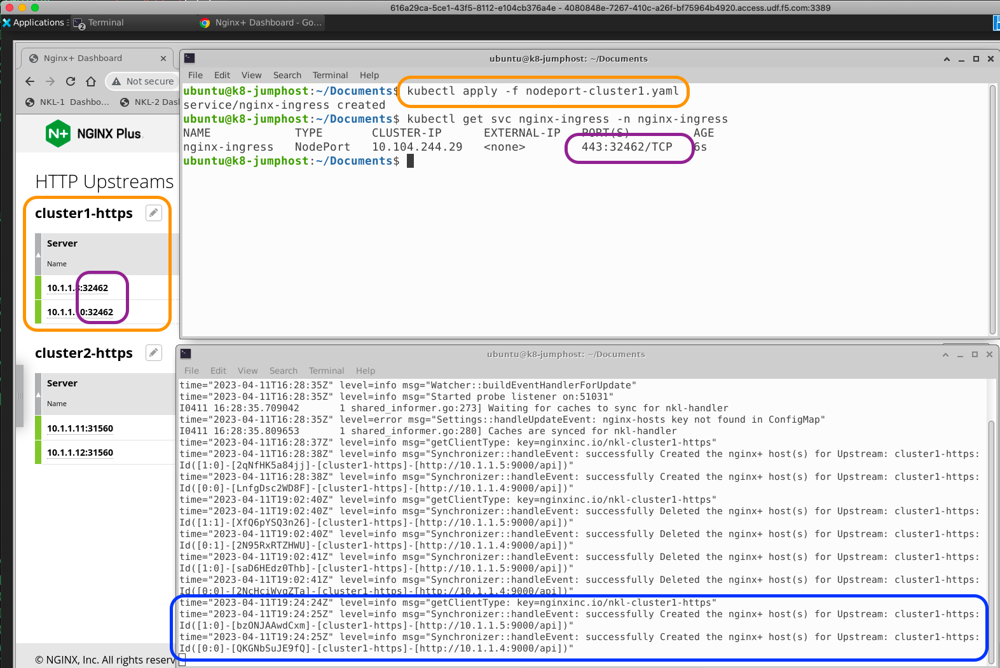

## NKL and MultiCluster Load Balancing with HTTP/S

 

## Overview

 

<<<<<<< HEAD
<<<<<<< HEAD
>With the NGINX Plus Servers located external to the Cluster, using NGINX's advanced HTTP/S features provide Enterprise class traffic management solutions.
=======
>With the Nginx Plus Servers located external to the Cluster, using Nginx's advanced HTTP/S features provide Enterprise traffic management solutions.
>>>>>>> change to NGINX
=======
>With the NGINX Plus Servers located external to the Cluster, using NGINX's advanced HTTP/S features provide Enterprise class traffic management solutions.
>>>>>>> added step numbers
  
- MultiCluster Active/Active Load Balancing
- Horizontal Cluster Scaling
- HTTP Split Clients - for `A/B, Blue/Green, and Canary` test and production traffic steering.  Allows Cluster operations/maintainence like:
  - Node upgrades
  - Software upgrades/security patches
  - Cluster resource expansions
  - Troubleshooting
  - ^^ With NO downtime or reloads
<<<<<<< HEAD
<<<<<<< HEAD
- NGINX Zone Sync of KeyVal data
- API Gateway functions
- Advanced TLS Processing - MutualTLS, OCSP, FIPS, dynamic cert loading
- Advanced Security features - App Protect WAF Firewall, Oauth, JWT, Dynamic Rate and Bandwidth limits, GeoIP, IP block/allow lists
- NGINX Java Script (NJS) for custom solutions

 

## Reference Diagram for NKL HTTP MultiCluster Load Balancing Solution

 

Multiple K8s Clusters, HA NGINX Plus LB Servers, NKL Controllers

 

NKL Watching nginx-ingress Service and Updating HTTP Upstreams; Service Type Loadbalancer or NodePort:

or

 

MultiCluster Load Balancing

 

NGINX HTTP Split Clients with Dynamic Ratio -- 10% Cluster1 : 90% Cluster2 

=======
- Nginx Zone Sync of KeyVal data
=======
- NGINX Zone Sync of KeyVal data
>>>>>>> added step numbers
- API Gateway functions
- Advanced TLS Processing - MutualTLS, OCSP, FIPS, dynamic cert loading
- Advanced Security features - App Protect WAF Firewall, Oauth, JWT, Dynamic Rate and Bandwidth limits, GeoIP, IP block/allow lists
- NGINX Java Script (NJS) for custom solutions

 

## Reference Diagram for NKL HTTP MultiCluster Load Balancing Solution

 

Multiple K8s Clusters, HA NGINX Plus LB Servers, NKL Controllers

 

NKL Watching nginx-ingress Service and Updating HTTP Upstreams; Service Type Loadbalancer or NodePort:

or

 

MultiCluster Load Balancing

 

<<<<<<< HEAD

Nginx HTTP Split Clients with Dynamic Ratio -- 10% Cluster1 : 90% Cluster2 
>>>>>>> change to NGINX
=======
NGINX HTTP Split Clients with Dynamic Ratio -- 10% Cluster1 : 90% Cluster2 

>>>>>>> added step numbers

 

The `Installation Guide` for HTTP MultiCluster Solution is located in the docs/http folder:

[HTTP MultiCluster Loadbalancing Guide](../http/http-installation-guide.md)

 
<<<<<<< HEAD
<<<<<<< HEAD

## Authors
- Chris Akker - Solutions Architect - Community and Alliances @ F5, Inc.
- Steve Wagner - Solutions Architect - Community and Alliances @ F5, Inc.
=======
>>>>>>> change to NGINX
=======

## Authors
- Chris Akker - Solutions Architect - Community and Alliances @ F5, Inc.
- Steve Wagner - Solutions Architect - Community and Alliances @ F5, Inc.
>>>>>>> added step numbers
