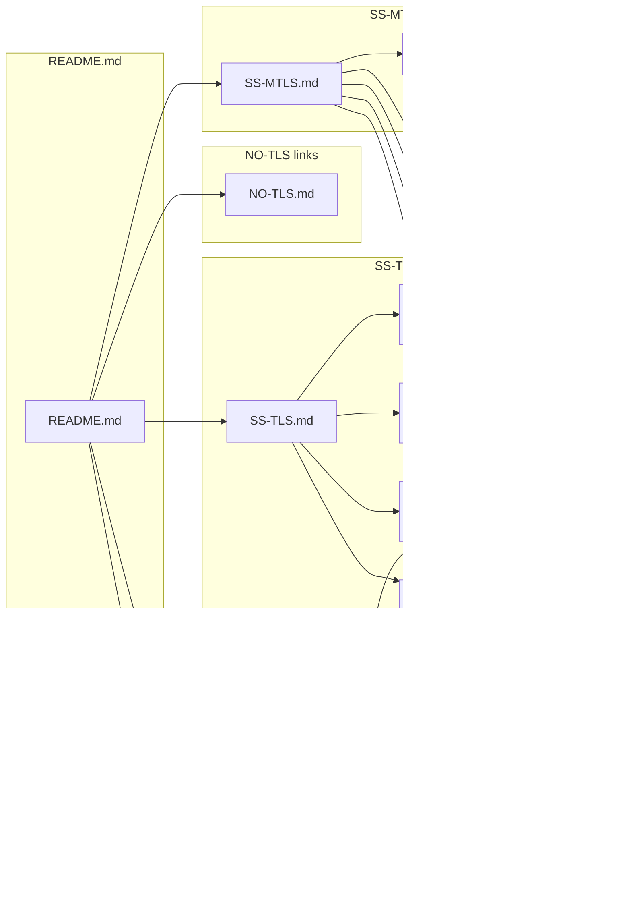

```mermaid
graph LR
    README[README.md]
    SS-TLS[SS-TLS.md]
    SS-MTLS[SS-MTLS.md]
    CA-TLS[CA-TLS.md]
    CA-MTLS[CA-MTLS.md]
    NO-TLS[NO-TLS.md]
    CERTIFICATE-AUTHORITY[CERTIFICATE-AUTHORITY.md]
    CLIENT-CERTIFICATE[CLIENT-CERTIFICATE.md]
    SERVER-CERTIFICATE[SERVER-CERTIFICATE.md]
    KUBERNETES-SECRETS[KUBERNETES-SECRETS.md]
    NGINX-PLUS-CONFIGURATION[NGINX-PLUS-CONFIGURATION.md]
    KUBERNETES-SECRETS[KUBERNETES-SECRETS.md]

    subgraph "README.md"
        README
    end
    
    subgraph "NO-TLS links"
        README --> NO-TLS
    end
    
    subgraph "SS-TLS links"
        README --> SS-TLS
        SS-TLS --> CERTIFICATE-AUTHORITY
        SS-TLS --> SERVER-CERTIFICATE
        SS-TLS --> KUBERNETES-SECRETS
        SS-TLS --> NGINX-PLUS-CONFIGURATION
    end
    
    subgraph "SS-MTLS links"
        README --> SS-MTLS
        SS-MTLS --> CERTIFICATE-AUTHORITY
        SS-MTLS --> SERVER-CERTIFICATE
        SS-MTLS --> CLIENT-CERTIFICATE
        SS-MTLS --> KUBERNETES-SECRETS
        SS-MTLS --> NGINX-PLUS-CONFIGURATION
    end
    
    subgraph "CA-TLS links"
        README --> CA-TLS
        CA-TLS --> NGINX-PLUS-CONFIGURATION
    end
    
    subgraph "CA-MTLS links"
        README --> CA-MTLS
        CA-MTLS --> KUBERNETES-SECRETS
        CA-MTLS --> NGINX-PLUS-CONFIGURATION
    end
```