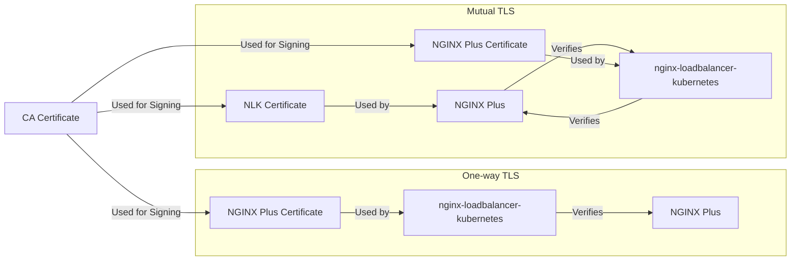

# TLS in NLK

NGINX Loadbalancer for Kubernetes, or NLK, is a Kubernetes Controller that uses NGINX Plus to load balance traffic to Kubernetes Services.

## What is TLS?

Transport Layer Security, or TLS, is a cryptographic protocol that provides end-to-end security of data sent between applications over the Internet; TLS is the successor to Secure Sockets Layer, or SSL[^1].

TLS serves two primary purposes:
* Authentications of actors in a communication channel;
* Encryption of data sent between actors in a communication channel;

## TLS uses Certificates

A Transport Layer Security (TLS) certificate, also known as an SSL certificate (Secure Sockets Layer), is a digital document that plays a crucial role in securing internet communications. Imagine it as a special, electronic passport for websites.

A TLS certificate includes a "Chain of Trust" where there are multiple certificates that are used to verify the authenticity of the certificate. The certificate at the top of the chain is called the Root Certificate Authority (CA) Certificate. The Root CA Certificate is used to sign the certificates below it in the chain. The Root CA Certificate is not signed by any other certificate in the chain.

The Root CA Certificate is used to sign the Intermediate CA Certificate. The Intermediate CA Certificate is used to sign the TLS Certificate. The TLS Certificate is used to sign the TLS Certificate Signing Request (CSR). The TLS Certificate Signing Request is used to sign the TLS Certificate.

Root CA certificates can be expensive and are not required for most use cases. An alternative to purchasing an Intermediate CA certificate is to use a self-signed certificate. Self-signed certificates are free and can be used to sign TLS certificates.

## One-way TLS and Mutual TLS

There are two types of TLS: one-way TLS and mutual TLS.

### One-way TLS

One-way TLS is the most common type of TLS. In one-way TLS, the client verifies the server's identity, but the server does not verify the client's identity. One-way TLS is used to secure the connection between the client and the server.

### Mutual TLS

Mutual TLS is less common than one-way TLS. In mutual TLS, the client verifies the server's identity, and the server verifies the client's identity. Mutual TLS is used to secure the connection between the client and the server.

The following diagram shows the difference between one-way TLS and mutual TLS.

## TLS in NLK

NLK supports three options for securing communications between the NLK and NGINX Plus:

1. No TLS
2. TLS with self-signed certificates
3. TLS with certificates signed by a Certificate Authority (CA)

Within the TLS options there are two sub-options:

1. One-way TLS
2. Mutual TLS

This gives five options for securing communications between the NLK and NGINX Plus.

* No TLS: No authentication nor encryption is used.
* One-way TLS with self-signed certificates: The NLK verifies the NGINX Plus's identity, but the NGINX Plus does not verify the NLK's identity.
* One-way TLS with certificates signed by a CA: The NLK verifies the NGINX Plus's identity, but the NGINX Plus does not verify the NLK's identity.
* Mutual TLS with self-signed certificates: The NLK verifies the NGINX Plus's identity, and the NGINX Plus verifies the NLK's identity.
* Mutual TLS with certificates signed by a CA: The NLK verifies the NGINX Plus's identity, and the NGINX Plus verifies the NLK's identity.

### Configuring TLS in NLK

NLK uses a Kubernetes ConfigMap to configure TLS. The ConfigMap is named `nlk-config` and is located in the `nlk` namespace.

There are three fields in the ConfigMap that are used to configure TLS:
* tls-mode: The TLS mode to use. Valid values are `none`, `ss-tls`, `ss-mtls`, `ca-tls`, and `ca-mtls`.
* ca-certificate: The CA certificate to use. This field is only used when `tls-mode` is set to `ss-tls` or `ss-mtls`. This certificate contains the "Chain of Trust" that is used to verify the authenticity of the TLS certificate.
* client-certificate: The client certificate to use. This field is only used when `tls-mode` is set to `ss-mtls` or `ca-mtls`. This certificate is provided to the NGINX Plus hosts for client authentication.

The fields required depend on the `tls-mode` value.

### How NLK uses TLS

NLK uses the `github.com/nginxinc/nginx-plus-go-client` to communicate with the NGINX Plus API. This library accepts a low-level HTTP client that is used for the actual communication with the NGINX Plus hosts. NLK generates a TLS Configuration based on the configured `tls-mode` and provides it to the low-level HTTP client.

[^1]: Source: [TLS Basics](https://www.internetsociety.org/deploy360/tls/basics/)