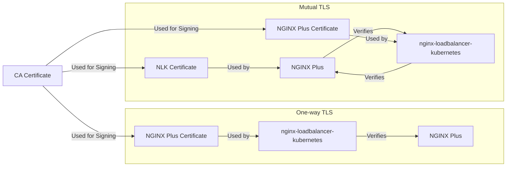

# Securing communication between NLK and NGINX Plus with TLS / mTLS

> [!WARNING]
> THIS FEATURE IS IN DEVELOPMENT. THIS NOTICE WILL BE REMOVED WHEN THE IMPLEMENTATION IS COMPLETE.  

This document describes how to configure TLS / mTLS to secure communication between NLK and NGINX Plus.

For development and test environments, using secure communication may not be necessary; however, in production environments
communications should be encrypted. More importantly, communications should be restricted to known actors.

Using TLS / mTLS provides the following benefits:
- Confidentiality: communications are encrypted
- Integrity: communications are protected from tampering
- Authentication: communications are restricted to known actors

NLK supports three options for securing communications between the NLK and NGINX Plus:

1. No TLS
2. TLS with self-signed certificates
3. TLS with certificates signed by a Certificate Authority (CA)

Within the TLS options there are two sub-options:

1. One-way TLS
2. Mutual TLS

The following diagram shows a visual representation of the One-way and Mutual TLS options 
(the "CA Certificate" can be either self-signed or signed by a well-known CA):

## No TLS

This option, denoted as `no-tls`, is the easiest to configure, but provides no security. It is not recommended for production environments.

This is the default mode of operation for NLK.

## TLS with self-signed certificates

This option is more secure than no TLS. With this option the certificates are self-signed, and therefore not trusted by default. 
This means that NGINX Plus and NLK will need to be configured to trust the certificates.

### One-way TLS

In this mode, denoted as `ss-tls`, NLK will trust the server certificate, but NLK presents no certificate to be validated.
Since self-signed certificates are used, NLK will need to be configured to trust the server certificate. 
This is done by adding the CA certificate to NLK's trust store. In order to do this, 
the CA certificate will need to be provided to NLK via a Kubernetes Secret.

Instructions for configuring One-way TLS with self-signed certificates can be found [here](SS-TLS.md).

### Mutual TLS

In this mode, denoted as `ss-mtls`, NLK will trust the server certificate, and the server will trust the NLK certificate.
Since self-signed certificates are used, NLK will need to be configured to trust the server certificate. Additionally,
the server will need to be configured to trust the NLK certificate. In order to do this, the CA certificate will need to be
provided to NLK via a Kubernetes Secret, and to the server by copying the CA certificate to the NGINX Plus host.

Instructions for configuring Mutual TLS with self-signed certificates can be found [here](SS-MTLS.md).

## TLS with certificates signed by a Certificate Authority (CA)

This is the most secure option. With this option the certificates are signed by a CA, and therefore trusted by default.

### One-way TLS

In this mode, denoted as `ca-tls`, NLK will trust the server certificate, but NLK presents no certificate and cannot be verified by the server.

Instructions for configuring One-way TLS with a CA-signed certificate can be found [here](CA-TLS.md).

### Mutual TLS

In this mode, denoted as `ca-mtls`, NLK will trust the server certificate, and the server will trust the NLK certificate.

Instructions for configuring Mutual TLS with a CA-signed certificate can be found [here](CA-MTLS.md).

## Considerations

No TLS may be acceptable for development and testing, but is not recommended for production environments.

If the highest level of trust and security is not required, but secure communication is, then mutual TLS with self-signed certificates is recommended.
This option provides a reasonable level of security, especially when the environments are sufficiently hardened and access is controlled.

If the highest level of trust and security is required then Mutual TLS with certificates signed by a CA is recommended.

## Next Steps

Follow the guide appropriate for your preferred mode:
- [No TLS](NO-TLS.md)
- [One-way TLS with self-signed certificates](SS-TLS.md)
- [Mutual TLS with self-signed certificates](SS-MTLS.md)
- [One-way TLS with certificates signed by a Certificate Authority (CA)](CA-TLS.md)
- [Mutal TLS with certificates signed by a Certificate Authority (CA)](CA-MTLS.md)
